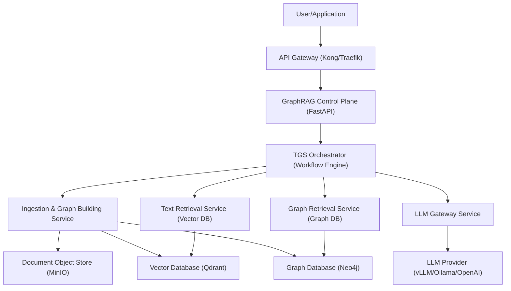

Absolutely, I will now meticulously plan the next phase of research to create a robust architectural blueprint. This plan is structured like a Product Requirements Document (PRD), designed to be both actionable and implementable for a production-grade, enterprise-ready TGS-RAG solution. The goal is to translate the validated research into a concrete, scalable, and maintainable software system.

---

## 1. System Overview & Core Philosophy

### 1.1. Vision
To build an enterprise-grade, cloud-native Retrieval-Augmented Generation (RAG) system that fundamentally solves the "Information Island" problem by implementing the **TGS-RAG bidirectional framework**. The system will seamlessly blend the semantic understanding of text with the structural precision of knowledge graphs for high-accuracy, multi-hop reasoning. 

### 1.2. Key Differentiators & Core Principles
*   **Neuro-Symbolic Synergy**: Not a simple hybrid, but a true bidirectional verification loop. The text channel corrects graph pruning errors, and the graph channel refines text retrieval noise. 
*   **Memory-Based Efficiency**: The pioneering "Orphan Entity Bridging" mechanism treats pruned nodes as deferred knowledge, not discarded failures, enabling path resurrection without expensive re-computation. 
*   **Enterprise-Grade by Default**: Architected for multi-tenancy, high availability, and strict data privacy from day one. Every component is built with observability, configuration, and horizontal scalability in mind.
*   **API-First Design**: All functionality is exposed via well-defined, versioned RESTful APIs and a gRPC endpoint for high-throughput internal communication.

---

## 2. Architectural Blueprint & Component Design

The system is broken down into a microservices architecture, aligning with the distinct responsibilities of the TGS-RAG framework. This modularity is critical for independent scaling, technology heterogeneity, and fault isolation, as seen in enterprise RAG platforms like OPEA. 

### 2.1. High-Level System Context Diagram (C4 Model - Level 1)

---

## 3. Detailed Component Specifications

### 3.1. Ingestion & Knowledge Graph Building Service
This service is responsible for processing raw documents and constructing both the vector and graph indices offline.

*   **Input**: Raw documents (PDF, DOCX, TXT, MD, HTML). 
*   **Sub-components**:
    1.  **Document Parser & Chunker**: A unified ingestion pipeline that handles multiple formats, extracts text, and semantically chunks content. This is a critical component for maintaining context. 
    2.  **Entity & Relationship Extraction Pipeline**: A high-throughput pipeline, likely leveraging the Neo4j GraphRAG package `SimpleKGPipeline` or a custom implementation, to extract entities and relationships from text chunks. 
    3.  **Vectorizer**: Encodes text chunks into embeddings using a configurable model (e.g., from `sentence-transformers`) and stores them alongside metadata in the vector database. 
    4.  **Graph Builder**: Populates the knowledge graph database (Neo4j) with extracted entities as nodes and relationships as edges. This step creates the structured representation for the TGS-RAG framework. 
*   **Output**: A synchronized vector store and knowledge graph, ready for bidirectional retrieval.

### 3.2. Query Orchestration Engine (The TGS-RAG Core)
This is the brain of the system, implementing the key bidirectional algorithms detailed in the research paper. It receives a user query and orchestrates the entire retrieval and reasoning process, replacing the need for a rigid agentic loop.

*   **Step 1: Initial Parallel Retrieval**: The orchestrator simultaneously dispatches the query to both the `Text Retrieval Service` (for semantic chunks) and the `Graph Retrieval Service` (for structured paths). 
*   **Step 2: Graph-to-Text Channel (Global Voting)**: 
    *   The `Graph Retrieval Service` performs a **Semantic Beam Search** from the query entities, storing all visited paths in a `Visited Memory` cache. 
    *   It implements a **Global Voting strategy**: each visited graph node "votes" for its source text chunks, allowing the orchestrator to re-rank the initially retrieved text chunks and filter out semantic noise. 
*   **Step 3: Text-to-Graph Channel (Memory-based Orphan Entity Bridging)**:
    *   The orchestrator analyzes the validated text chunks for potential relevant entities that were *not* part of the initial graph paths (orphan entities). 
    *   It then checks the `Visited Memory` cache. If these orphan entities were pruned during beam search, their paths are instantly "resurrected" without additional database queries. 
*   **Step 4: Context Fusion & Generation**: The complete, bidirectional-verified context is assembled and sent to the `LLM Gateway Service` for final answer generation.

### 3.3. LLM Gateway Service
An abstraction layer over different LLM providers.

*   **Responsibilities**: 
    *   Load balancing across multiple LLM backends (vLLM, Ollama, OpenAI, Anthropic). 
    *   Prompt template management and versioning.
    *   Token usage tracking and cost attribution for each request.
    *   Streaming support via Server-Sent Events (SSE) for a responsive user experience. 
*   **Implementation**: A lightweight, stateless FastAPI service.

---

## 4. Data Models & Storage Strategy

### 4.1. Vector Database (Qdrant)
*   **Purpose**: Semantic text retrieval. 
*   **Collections**: 
    *   `chunks_{tenant_id}`: For storing document chunks with metadata like source document, chunk index, and a reference ID linking back to the Neo4j graph node. 
*   **Optimization**: Use disk-optimized index types (e.g., HNSW) for cost-effective scaling to 10M+ documents. 

### 4.2. Graph Database (Neo4j)
*   **Purpose**: Structured knowledge storage and graph traversal. 
*   **Schema**: A property-graph model. Key node labels include `Entity`, `Document`, `Chunk`. Key relationship types include `MENTIONS`, `CONTAINS`, and domain-specific relations. 
*   **Integration**: The `neo4j-graphrag` Python package will be the primary interface for building and querying the knowledge graph. 

### 4.3. Document Object Store (MinIO)
*   **Purpose**: S3-compatible storage for raw documents, enabling re-processing and providing a source of truth.

---

## 5. Enterprise-Grade Non-Functional Requirements

### 5.1. Scalability & Performance
*   **Horizontal Scalability**: All microservices (Ingestion, Retrieval, API) must be stateless and horizontally scalable. Kubernetes (K8s) will be the orchestration platform. 
*   **Caching**: A Redis cache will be deployed for:
    *   `Visited Memory` cache for the Orphan Entity Bridging algorithm. 
    *   Caching frequent query results and LLM responses to drastically reduce latency and cost.
*   **Asynchronous Processing**: Long-running tasks like document ingestion will be offloaded to a task queue (Celery with Redis broker), with the ability to auto-scale workers. 

### 5.2. Security & Multi-Tenancy
*   **Data Isolation**: Implement database-per-tenant or schema-per-tenant isolation. All queries and indices will be prefixed with a `tenant_id`. 
*   **Authentication & Authorization**: Integrate with enterprise identity providers (OIDC/SAML) using JWT-based authentication. Role-based access control (RBAC) will govern which users can ingest documents or query specific collections. 

### 5.3. Observability & Monitoring
*   **Metrics**: All services will expose Prometheus metrics (request latency, error rates, token usage, retrieval precision). 
*   **Tracing**: Implement distributed tracing using OpenTelemetry to visualize the entire lifecycle of a query across microservices, a critical capability for debugging complex RAG pipelines. 
*   **Logging**: Structured JSON logging to stdout, aggregated by tools like Grafana Loki or the ELK stack. 

### 5.4. Deployment & DevOps
*   **Containerization**: All components will be Dockerized.
*   **CI/CD**: A robust pipeline (e.g., GitHub Actions) will automate testing, building, and deployment to a Kubernetes cluster.
*   **Infrastructure as Code (IaC)**: Define all infrastructure using Terraform or Pulumi for reproducibility and environment parity.

---

## 6. Technology Stack Recommendations

| Component | Recommended Technology | Justification |
| :--- | :--- | :--- |
| **API Framework** | **FastAPI** | Asynchronous, high-performance, auto-generated OpenAPI docs, native SSE support.  |
| **LLM Server** | **vLLM / Ollama** | High-throughput, low-cost LLM serving with OpenAI-compatible API. |
| **Vector Database** | **Qdrant** | High-performance, Rust-based, with excellent filtering capabilities.  |
| **Graph Database** | **Neo4j** | Industry standard, mature, with an official Python GraphRAG package.  |
| **Cache** | **Redis** | In-memory data structure store for task brokering and caching.  |
| **Message Broker** | **Redis / RabbitMQ** | Reliable task distribution for Celery. |
| **Container Orchestrator** | **Kubernetes (K8s)** | For automated deployment, scaling, and management of microservices.  |
| **Monitoring** | **Grafana, Prometheus, OpenTelemetry** | Unified, open-source standard for metrics, logs, and traces.  |

---

## 7. Implementation Roadmap (Phased Approach)

### Phase 1: Foundation (MVP)
*   Set up the core project structure, monorepo, and CI/CD pipeline.
*   Implement the `Ingestion Service` with `Unstructured.io` and the Neo4j graph builder. 
*   Set up Qdrant and Neo4j instances.
*   Develop the `Text Retrieval Service` for semantic search.

### Phase 2: The TGS-RAG Core
*   Implement the `TGS Orchestrator` with the bidirectional workflow.
*   Develop the **Global Voting** and **Memory-based Orphan Entity Bridging** algorithms. This is the riskiest and most critical part.
*   Build the `LLM Gateway Service`.

### Phase 3: Enterprise Hardening
*   Implement multi-tenancy, RBAC, and JWT authentication.
*   Integrate Prometheus metrics, OpenTelemetry tracing, and Grafana dashboards.
*   Finalize Kubernetes Helm charts and IaC for production deployment.

---

## 8. Critical Success Factors & Risk Mitigation

*   **Accuracy of Entity Extraction**: The entire framework depends on the quality of the knowledge graph. Mitigation: Implement a continuous evaluation loop using a golden dataset to benchmark extraction performance against fine-tuned models like GLiNER. 
*   **Orphan Entity Bridging Efficiency**: The algorithm's in-memory operations must be extremely fast. Mitigation: Use Redis with sorted sets to store and query visited paths, ensuring sub-millisecond latency.
*   **Cold Start Problem**: New document corpora will have no graph. Mitigation: The `TGS Orchestrator` must gracefully degrade to a "Text-Only" mode if the graph query returns insufficient results, falling back to a standard semantic search until the graph index is built.

This research plan provides a complete, actionable blueprint for building a TGS-RAG system that is not only scientifically accurate but also production-ready, scalable, and secure.

# https://chat.deepseek.com/share/covsterhki4nsw5608 
