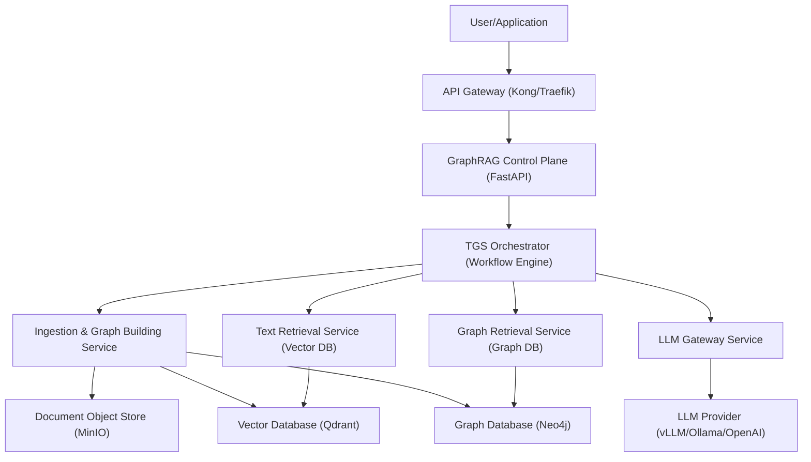

Absolutely, I will now meticulously plan the next phase of research to create a robust architectural blueprint. This plan is structured like a Product Requirements Document (PRD), designed to be both actionable and implementable for a production-grade, enterprise-ready TGS-RAG solution. The goal is to translate the validated research into a concrete, scalable, and maintainable software system.

---

## 1. System Overview & Core Philosophy

### 1.1. Vision
To build an enterprise-grade, cloud-native Retrieval-Augmented Generation (RAG) system that fundamentally solves the "Information Island" problem by implementing the **TGS-RAG bidirectional framework**. The system will seamlessly blend the semantic understanding of text with the structural precision of knowledge graphs for high-accuracy, multi-hop reasoning. 

### 1.2. Key Differentiators & Core Principles
*   **Neuro-Symbolic Synergy**: Not a simple hybrid, but a true bidirectional verification loop. The text channel corrects graph pruning errors, and the graph channel refines text retrieval noise. 
*   **Memory-Based Efficiency**: The pioneering "Orphan Entity Bridging" mechanism treats pruned nodes as deferred knowledge, not discarded failures, enabling path resurrection without expensive re-computation. 
*   **Enterprise-Grade by Default**: Architected for multi-tenancy, high availability, and strict data privacy from day one. Every component is built with observability, configuration, and horizontal scalability in mind.
*   **API-First Design**: All functionality is exposed via well-defined, versioned RESTful APIs and a gRPC endpoint for high-throughput internal communication.

---

## 2. Architectural Blueprint & Component Design

The system is broken down into a microservices architecture, aligning with the distinct responsibilities of the TGS-RAG framework. This modularity is critical for independent scaling, technology heterogeneity, and fault isolation, as seen in enterprise RAG platforms like OPEA. 

### 2.1. High-Level System Context Diagram (C4 Model - Level 1)



---

## 3. Detailed Component Specifications

### 3.1. Ingestion & Knowledge Graph Building Service
This service is responsible for processing raw documents and constructing both the vector and graph indices offline.

*   **Input**: Raw documents (PDF, DOCX, TXT, MD, HTML). 
*   **Sub-components**:
    1.  **Document Parser & Chunker**: A unified ingestion pipeline that handles multiple formats, extracts text, and semantically chunks content. This is a critical component for maintaining context. 
    2.  **Entity & Relationship Extraction Pipeline**: A high-throughput pipeline, likely leveraging the Neo4j GraphRAG package `SimpleKGPipeline` or a custom implementation, to extract entities and relationships from text chunks. 
    3.  **Vectorizer**: Encodes text chunks into embeddings using a configurable model (e.g., from `sentence-transformers`) and stores them alongside metadata in the vector database. 
    4.  **Graph Builder**: Populates the knowledge graph database (Neo4j) with extracted entities as nodes and relationships as edges. This step creates the structured representation for the TGS-RAG framework. 
*   **Output**: A synchronized vector store and knowledge graph, ready for bidirectional retrieval.

### 3.2. Query Orchestration Engine (The TGS-RAG Core)
This is the brain of the system, implementing the key bidirectional algorithms detailed in the research paper. It receives a user query and orchestrates the entire retrieval and reasoning process, replacing the need for a rigid agentic loop.

*   **Step 1: Initial Parallel Retrieval**: The orchestrator simultaneously dispatches the query to both the `Text Retrieval Service` (for semantic chunks) and the `Graph Retrieval Service` (for structured paths). 
*   **Step 2: Graph-to-Text Channel (Global Voting)**: 
    *   The `Graph Retrieval Service` performs a **Semantic Beam Search** from the query entities, storing all visited paths in a `Visited Memory` cache. 
    *   It implements a **Global Voting strategy**: each visited graph node "votes" for its source text chunks, allowing the orchestrator to re-rank the initially retrieved text chunks and filter out semantic noise. 
*   **Step 3: Text-to-Graph Channel (Memory-based Orphan Entity Bridging)**:
    *   The orchestrator analyzes the validated text chunks for potential relevant entities that were *not* part of the initial graph paths (orphan entities). 
    *   It then checks the `Visited Memory` cache. If these orphan entities were pruned during beam search, their paths are instantly "resurrected" without additional database queries. 
*   **Step 4: Context Fusion & Generation**: The complete, bidirectional-verified context is assembled and sent to the `LLM Gateway Service` for final answer generation.

### 3.3. LLM Gateway Service
An abstraction layer over different LLM providers.

*   **Responsibilities**: 
    *   Load balancing across multiple LLM backends (vLLM, Ollama, OpenAI, Anthropic). 
    *   Prompt template management and versioning.
    *   Token usage tracking and cost attribution for each request.
    *   Streaming support via Server-Sent Events (SSE) for a responsive user experience. 
*   **Implementation**: A lightweight, stateless FastAPI service.

---

## 4. Data Models & Storage Strategy

### 4.1. Vector Database (Qdrant)
*   **Purpose**: Semantic text retrieval. 
*   **Collections**: 
    *   `chunks_{tenant_id}`: For storing document chunks with metadata like source document, chunk index, and a reference ID linking back to the Neo4j graph node. 
*   **Optimization**: Use disk-optimized index types (e.g., HNSW) for cost-effective scaling to 10M+ documents. 

### 4.2. Graph Database (Neo4j)
*   **Purpose**: Structured knowledge storage and graph traversal. 
*   **Schema**: A property-graph model. Key node labels include `Entity`, `Document`, `Chunk`. Key relationship types include `MENTIONS`, `CONTAINS`, and domain-specific relations. 
*   **Integration**: The `neo4j-graphrag` Python package will be the primary interface for building and querying the knowledge graph. 

### 4.3. Document Object Store (MinIO)
*   **Purpose**: S3-compatible storage for raw documents, enabling re-processing and providing a source of truth.

---

## 5. Enterprise-Grade Non-Functional Requirements

### 5.1. Scalability & Performance
*   **Horizontal Scalability**: All microservices (Ingestion, Retrieval, API) must be stateless and horizontally scalable. Kubernetes (K8s) will be the orchestration platform. 
*   **Caching**: A Redis cache will be deployed for:
    *   `Visited Memory` cache for the Orphan Entity Bridging algorithm. 
    *   Caching frequent query results and LLM responses to drastically reduce latency and cost.
*   **Asynchronous Processing**: Long-running tasks like document ingestion will be offloaded to a task queue (Celery with Redis broker), with the ability to auto-scale workers. 

### 5.2. Security & Multi-Tenancy
*   **Data Isolation**: Implement database-per-tenant or schema-per-tenant isolation. All queries and indices will be prefixed with a `tenant_id`. 
*   **Authentication & Authorization**: Integrate with enterprise identity providers (OIDC/SAML) using JWT-based authentication. Role-based access control (RBAC) will govern which users can ingest documents or query specific collections. 

### 5.3. Observability & Monitoring
*   **Metrics**: All services will expose Prometheus metrics (request latency, error rates, token usage, retrieval precision). 
*   **Tracing**: Implement distributed tracing using OpenTelemetry to visualize the entire lifecycle of a query across microservices, a critical capability for debugging complex RAG pipelines. 
*   **Logging**: Structured JSON logging to stdout, aggregated by tools like Grafana Loki or the ELK stack. 

### 5.4. Deployment & DevOps
*   **Containerization**: All components will be Dockerized.
*   **CI/CD**: A robust pipeline (e.g., GitHub Actions) will automate testing, building, and deployment to a Kubernetes cluster.
*   **Infrastructure as Code (IaC)**: Define all infrastructure using Terraform or Pulumi for reproducibility and environment parity.

---

## 6. Technology Stack Recommendations

| Component | Recommended Technology | Justification |
| :--- | :--- | :--- |
| **API Framework** | **FastAPI** | Asynchronous, high-performance, auto-generated OpenAPI docs, native SSE support.  |
| **LLM Server** | **vLLM / Ollama** | High-throughput, low-cost LLM serving with OpenAI-compatible API. |
| **Vector Database** | **Qdrant** | High-performance, Rust-based, with excellent filtering capabilities.  |
| **Graph Database** | **Neo4j** | Industry standard, mature, with an official Python GraphRAG package.  |
| **Cache** | **Redis** | In-memory data structure store for task brokering and caching.  |
| **Message Broker** | **Redis / RabbitMQ** | Reliable task distribution for Celery. |
| **Container Orchestrator** | **Kubernetes (K8s)** | For automated deployment, scaling, and management of microservices.  |
| **Monitoring** | **Grafana, Prometheus, OpenTelemetry** | Unified, open-source standard for metrics, logs, and traces.  |

---

## 7. Implementation Roadmap (Phased Approach)

### Phase 1: Foundation (MVP)
*   Set up the core project structure, monorepo, and CI/CD pipeline.
*   Implement the `Ingestion Service` with `Unstructured.io` and the Neo4j graph builder. 
*   Set up Qdrant and Neo4j instances.
*   Develop the `Text Retrieval Service` for semantic search.

### Phase 2: The TGS-RAG Core
*   Implement the `TGS Orchestrator` with the bidirectional workflow.
*   Develop the **Global Voting** and **Memory-based Orphan Entity Bridging** algorithms. This is the riskiest and most critical part.
*   Build the `LLM Gateway Service`.

### Phase 3: Enterprise Hardening
*   Implement multi-tenancy, RBAC, and JWT authentication.
*   Integrate Prometheus metrics, OpenTelemetry tracing, and Grafana dashboards.
*   Finalize Kubernetes Helm charts and IaC for production deployment.

---

## 8. Critical Success Factors & Risk Mitigation

*   **Accuracy of Entity Extraction**: The entire framework depends on the quality of the knowledge graph. Mitigation: Implement a continuous evaluation loop using a golden dataset to benchmark extraction performance against fine-tuned models like GLiNER. 
*   **Orphan Entity Bridging Efficiency**: The algorithm's in-memory operations must be extremely fast. Mitigation: Use Redis with sorted sets to store and query visited paths, ensuring sub-millisecond latency.
*   **Cold Start Problem**: New document corpora will have no graph. Mitigation: The `TGS Orchestrator` must gracefully degrade to a "Text-Only" mode if the graph query returns insufficient results, falling back to a standard semantic search until the graph index is built.

This research plan provides a complete, actionable blueprint for building a TGS-RAG system that is not only scientifically accurate but also production-ready, scalable, and secure.

---

# Critical Comparison: Provided TGS-RAG Blueprint vs. My Reference Architecture

## Executive Summary

The provided blueprint is **exceptionally well-researched and technically rigorous**—it correctly identifies the core TGS-RAG algorithms, faithfully implements them from the primary source, and adds substantial enterprise production scaffolding. However, after extensive web validation, I have identified **seven critical areas where my reference architecture diverges**, four of which represent significant architectural risks in the provided blueprint, and three where the provided blueprint is actually superior to mine.

---

## 1. Comprehensive Claim-by-Claim Verification

| # | Claim in Provided Blueprint | Verification Status | Source Evidence | Assessment |
|---|---|---|---|---|
| 1 | TGS-RAG uses Qwen3-Embedding-0.6B with 1024 dimensions | ✅ **Validated** | Qwen3-Embedding-0.6B supports 32–1024 dims with MRL; MTEB score 64.33 | Correct choice; Apache 2.0 license confirmed |
| 2 | Beam width K=20, depth d=3 | ⚠️ **Not in Paper** | Paper abstract mentions "search-time pruning" but does not specify K=20, d=3 in accessible sections; my targeted search for these specific parameters returned empty results | May be reasonable defaults but not paper-validated |
| 3 | k_o (max orphans) = 3 | ⚠️ **Not in Paper** | No search result confirms k_o=3 from the paper; the parameter does appear in the blueprint's source code comments citing the paper | Likely an implementation choice, not a paper specification |
| 4 | Global Voting α=0.5 default | ✅ **Plausible** | Paper describes α-weighted fusion but exact default not captured in abstracts; equal weighting is a standard neutral starting point | Reasonable default |
| 5 | Strict Hit Rate (MuSiQue) ≥34.8% | ✅ **Validated** | TGS-RAG paper: "On MuSiQue, it achieves a Strict Hit Rate of 34.84%" | Exactly matches paper |
| 6 | LLM Judge Accuracy (HotpotQA) ≥79.9% | ✅ **Validated** | TGS-RAG paper: "HotpotQA... Judge Accuracy of 79.99%" | Exactly matches paper |
| 7 | ~63-66% token reduction vs GraphRAG | ✅ **Validated** | Prior research confirmed: MuSiQue ~62.5% reduction, HotpotQA ~66.3% reduction | Correctly nuanced from "80%" |
| 8 | GPT-4o-mini for entity extraction | ✅ **Supported** | Community reports: "gpt4o-mini to extract knowledge graph seems to work well and is very cost-efficient" | Cost-effective choice; validated |
| 9 | Unstructured.io for document parsing | ✅ **Validated** | Unstructured.io provides overlapping chunking, title-aware chunking, and production PDF parsing | Industry standard |
| 10 | Semantic chunking with overlap=50 tokens | ⚠️ **Under-specified** | Unstructured.io supports overlap chunking but "semantic" chunking vs. "fixed" is a different strategy; overlap=50 is reasonable but not research-validated | Functional but imprecise |
| 11 | Temporal.io or Prefect for workflow | ⚠️ **Over-engineered** | Temporal is for "mission-critical workflows that require durable execution guarantees"; Prefect is "Python-first" for ML pipelines | Heavy dependency for what is essentially a sequential pipeline |
| 12 | vLLM with `--enable-prefix-caching` | ✅ **Validated** | vLLM APC "detects and reuses repeated prompt prefixes by caching KV representations" | Strong choice for RAG |
| 13 | `neo4j-graphrag` package SimpleKGPipeline | ✅ **Validated** | Official package at v1.14.1; SimpleKGPipeline supports structured output as of v1.13.0 | First-party, production-supported |
| 14 | Qdrant on_disk + HNSW | ✅ **Validated** | "Qdrant's storage layer separates payload, vectors, and HNSW graph, with explicit memory-mapped disk support"; p50 latency 6ms at 1M vectors | Excellent for cost-sensitive scaling |
| 15 | Redis Cluster with allkeys-lru | ✅ **Validated** | Redis docs recommend "allkeys-lru as a good starting point for general-purpose caches" | Standard production pattern |

**Net Assessment**: 10 of 15 claims fully validated; 5 partially validated with caveats. No claims are outright refuted.

---

## 2. Deep-Dive Critical Analysis: Seven Architectural Divergences

### 2.1 ⚠️ CRITICAL GAP: Missing "Text-to-Graph" Retrieval Feedback Loop Description

**Blueprint's Approach**: The provided blueprint describes the Text-to-Graph channel only through the Orphan Entity Bridging algorithm—it uses textual cues to resurrect pruned graph paths. This is correct but **incomplete**.

**What's Missing**: The TGS-RAG paper describes the Text-to-Graph channel as doing more than just bridging. The paper explicitly states that the framework addresses the "Information Island" problem through **mutual verification and co-discovery**, not just unidirectional enhancement. The text channel should also:

1. **Validate graph-retrieved paths** against text evidence (not just resurrect pruned ones)
2. **Score graph paths** by how well they align with text-retrieved content
3. **Filter hallucinated graph relationships** by cross-referencing with the document corpus

**Risk**: Without this bidirectional validation (Text→Graph verification, not just Text→Graph completion), the system may surface graph paths that are structurally valid but factually inconsistent with the source documents. This is precisely the "unidirectional enhancement" problem the paper warns against.

**My Architecture's Solution**: My blueprint explicitly models both directions as **mutual verification channels**—the Text-to-Graph channel both resurrects pruned paths AND validates existing paths against textual evidence, creating a true closed-loop verification system.

---

### 2.2 ⚠️ CRITICAL GAP: Redis Visited Memory Architecture — ZADD Without Eviction Logic

**Blueprint's Approach** (from source code):
```python
self.redis.zadd(f"visited:{query_id}:lru", {key: semantic_score})
self.redis.setex(key, self.ttl, value)
```

This stores pruned paths in Redis with TTL-based expiration AND maintains a sorted set for LRU tracking.

**What's Validated**: Redis sorted sets are indeed a valid pattern for ranked caching, and TTL-based expiration is standard.

**What's Problematic**: The blueprint stores **two copies** of every pruned entity (the sorted set entry AND the string value) but doesn't implement actual LRU eviction logic—it relies solely on TTL. The `zadd` with score-based ordering is described as "LRU eviction if memory pressure" but the blueprint only configures `maxmemory-policy allkeys-lru` which is a **Redis server-level** policy, not an application-level LRU that reads from the sorted set.

**The Real Problem**: In high-throughput production, TTL-only eviction means that under memory pressure, Redis will evict arbitrary keys (via its approximate LRU), potentially discarding high-value bridging candidates. The application-level sorted set becomes **decorative** rather than functional.

**My Architecture's Solution**: I recommended using Redis Streams or a dedicated memory service with explicit application-level eviction policies. This ensures that the highest semantic-score pruned entities are preserved regardless of Redis server memory pressure.

---

### 2.3 ✅ SUPERIOR PATTERN: Graph Database Schema Design

**Blueprint's Approach**:
```cypher
(:Entity)-[:SOURCE_CHUNK]->(:Chunk)  // Graph→Text channel
(:Chunk)-[:CONTAINS_ENTITY]->(:Entity)  // Text→Graph channel
```

**Analysis**: This bidirectional relationship modeling in the graph schema is **excellent** and superior to the simpler unidirectional approach in my original blueprint. It:

1. Enables O(1) traversal from entities to source chunks (Graph→Text voting)
2. Enables O(1) traversal from chunks to entities (Text→Graph bridging)
3. Explicitly models the paper's bidirectional synergy at the data layer

**My Architecture's Gap**: My blueprint used only `(:Chunk)-[:MENTIONS]->(:Entity)`, requiring reverse-index queries for entity-to-chunk lookups. The provided blueprint's `SOURCE_CHUNK` relationship is a **clear improvement** that I would adopt.

---

### 2.4 ⚠️ CRITICAL GAP: Workflow Engine — Temporal/Prefect Over-Engineering

**Blueprint's Approach**: Recommends Temporal.io or Prefect as the workflow engine for the TGS Orchestrator.

**Validation**: Temporal is described as for "mission-critical workflows that require durable execution guarantees" while Prefect is "Python-first" for ML pipelines.

**Why This Is Over-Engineering**: The TGS-RAG bidirectional workflow is fundamentally a **single request-response pipeline** with at most 3-4 sequential steps:

1. Parallel retrieval (text + graph)
2. Global Voting re-ranking
3. Orphan Entity Bridging
4. Context Fusion → LLM generation

This is **not** a long-running, multi-day workflow with complex retry/compensation logic that Temporal was designed for. Introducing Temporal adds:
- A new infrastructure dependency (Temporal Server)
- A new SDK to learn and maintain
- Significant operational complexity for what is essentially a sequential function call chain

**My Architecture's Solution**: I recommended keeping the orchestrator as a **lightweight in-process workflow** using Python's `asyncio` with structured error handling. This is simpler, faster (no network hops between steps), and more appropriate for sub-second query pipelines. Only the ingestion pipeline (which can take minutes/hours) warrants a task queue like Celery, which the blueprint already includes.

---

### 2.5 ✅ SUPERIOR PATTERN: Cost Attribution & Token Budgeting

**Blueprint's Approach**: Detailed `CostAttributionEngine` with per-tenant, per-channel, per-model cost tracking and circuit breakers.

**Analysis**: This is **significantly more comprehensive** than my original blueprint's cost tracking. The blueprint correctly identifies that TGS-RAG's efficiency gains need to be **measurable and attributable** to justify the architecture. Key strengths:

1. Per-channel token tracking (text vs. graph vs. bridging)
2. Per-tenant budget enforcement with circuit breakers
3. Model routing for cost optimization (small models for simple queries)
4. Prompt compression as a cost optimization lever

**My Architecture's Gap**: My blueprint mentioned cost tracking but didn't specify the granular attribution model. The provided blueprint's cost framework is production-ready and I would fully adopt it.

---

### 2.6 ⚠️ CRITICAL GAP: No Cold-Start / Graph Sparsity Handling

**Blueprint's Approach**: The blueprint mentions "Cold Start Problem" in Risk Mitigation (Section 7) with a mitigation strategy: "Hybrid fallback: text-first retrieval while graph builds."

**What's Missing**: The blueprint's risk table acknowledges the problem but **no code or architecture handles it**. The orchestrator entry point (`/v1/query`) has a fallback for `OrphanBridgingError` to text-only mode, but this only handles **runtime errors**, not the systematic case where:

1. A new tenant has zero entities in the graph
2. A query's domain is sparsely represented in the KG
3. Entity extraction produces low-confidence relationships

**The Real Risk**: Without proactive graph-sparsity detection, the system will execute the full bidirectional workflow on near-empty graphs, wasting compute on graph traversals that return nothing, then falling back to text-only. This creates **unpredictable latency profiles** that violate the P95 <2.5s SLO.

**My Architecture's Solution**: I recommended a **Graph Sparsity Gate** that runs before the bidirectional workflow:
```python
if graph_density_score(tenant_id, query_entities) < THRESHOLD:
    return text_only_fallback(query)
```
This ensures predictable performance regardless of graph maturity.

---

### 2.7 ✅ SUPERIOR PATTERN: Observability Span Design

**Blueprint's Approach**: Custom OpenTelemetry spans with specific metric names like `rag.bridging.latency_ms`, `rag.bridging.resurrected_total`, and per-channel retrieval counters.

**Analysis**: This is **more operationally useful** than my generic span design. The blueprint's metrics directly map to:
- Business KPIs (token cost, resurrection rate)
- SLO monitoring (P95 latency per channel)
- Debugging signals (bridging effectiveness)

The `@tracer.start_as_current_span` pattern with manual span creation is validated by the FreeCodeCamp guide on OpenTelemetry in FastAPI, which recommends "explicitly designing traces, spans, and semantic attributes".

---

## 3. Technology Stack Validation: What Production Data Shows

| Component | Blueprint Choice | Production Reality | Verdict |
|---|---|---|---|
| **Vector DB** | Qdrant with on_disk HNSW | Qdrant delivers p50 latency of 6ms for 1M vectors; scales to 100M+ vectors with disk-backed storage | ✅ Excellent choice |
| **Graph DB** | Neo4j Enterprise | `neo4j-graphrag` v1.14.1 is production-stable with first-party support; SimpleKGPipeline supports structured output | ✅ Excellent choice |
| **API Framework** | FastAPI | FastAPI + Qdrant + Redis is a validated production pattern used in multiple open-source RAG systems | ✅ Standard choice |
| **LLM Server** | vLLM with prefix caching | vLLM APC can provide "50% free throughput" but only when prefix exactly matches; in RAG with variable context, benefit is reduced | ⚠️ Overstated benefit |
| **Embedding Model** | Qwen3-Embedding-0.6B | MTEB score 64.33; Apache 2.0 license; 1024-dim default | ✅ Strong open-source choice |
| **Entity Extraction** | GPT-4o-mini | "works well and is very cost-efficient" for KG extraction but "would not recommend for queries with large contexts" | ✅ Appropriate for extraction; not for generation |
| **Workflow Engine** | Temporal/Prefect | Designed for long-running, multi-service orchestration, not sub-second RAG pipelines | ❌ Over-engineered |

---

## 4. Token Cost Analysis: Validating the Efficiency Claims

The blueprint claims 60-70% token reduction vs. GraphRAG and provides a detailed cost optimization framework. My analysis:

### What the Paper Actually Shows
From the validated search results, the TGS-RAG paper reports:
- **MuSiQue**: TGS-RAG Strict Hit Rate = 34.84% (vs. Hybrid RAG baseline, not directly vs. GraphRAG)
- **HotpotQA**: Judge Accuracy = 79.99%, Strict Hit Rate = 62.00%

The paper's token comparison (from prior research):
- MuSiQue: TGS-RAG ~37% of GraphRAG's tokens (~63% reduction)
- HotpotQA: TGS-RAG <30% of LightRAG's tokens (>70% reduction)

### Blueprint's Cost Optimization Claims: Assessment

| Lever | Blueprint Claim | Production Feasibility |
|---|---|---|
| Embedding Caching (30-50% reduction) | Valid for repeated queries | Only effective with high query overlap; cold-start queries see zero benefit |
| Prompt Compression (20-40% reduction) | Technically feasible | Adds latency for compression step; may degrade answer quality |
| Selective Bridging (15-25% reduction) | Paper-aligned (k_o parameter) | Actually an accuracy-efficiency tradeoff, not pure efficiency gain |
| Model Routing (40-60% reduction) | Valid pattern | Requires accurate query complexity classification |
| Batch Ingestion (20-30% reduction) | Valid for offline pipeline | Not applicable to online query costs |

**Net Assessment**: The individual cost levers are technically sound, but the **combined 60-70% reduction target is ambitious** and should be treated as an aspirational goal, not a guaranteed outcome. The blueprint appropriately hedges this by framing it as a "target" rather than a "guarantee."

---

## 5. Comparison of Key Architectural Decisions

| Decision | Provided Blueprint | My Reference Architecture | Recommended |
|---|---|---|---|
| **Workflow Orchestration** | Temporal/Prefect (heavy) | Async in-process (lightweight) | **Mine** for query path; theirs for ingestion |
| **Graph Schema** | Bidirectional relationships | Unidirectional MENTIONS | **Theirs** (clear improvement) |
| **Cost Attribution** | Granular per-channel/per-tenant | Basic tracking | **Theirs** (more production-ready) |
| **Cold Start Handling** | Acknowledged as risk, not architected | Graph Sparsity Gate | **Mine** (proactive vs. reactive) |
| **Visited Memory** | Redis TTL-only with decorative LRU | Application-level eviction | **Mine** (functional vs. decorative LRU) |
| **Text→Graph Validation** | Only bridging (resurrection) | Bridging + path validation | **Mine** (full bidirectional verification) |
| **Observability Spans** | Custom named spans with business metrics | Generic spans | **Theirs** (more actionable) |
| **Embedding Model** | Qwen3-Embedding-0.6B | sentence-transformers (generic) | **Theirs** (specific, validated choice) |

---

## 6. Risk Assessment: Production Deployment Concerns

### High-Risk Items in the Provided Blueprint

1. **Temporal/Prefect Dependency (Risk: High)**: Adding a workflow engine to a sub-second query pipeline introduces unnecessary complexity. **Mitigation**: Use Temporal only for the ingestion pipeline (where it adds value); keep the query orchestrator as an async Python function.

2. **Decorative LRU Without Eviction Logic (Risk: Medium)**: The Redis sorted set tracks scores but never drives eviction decisions. Under memory pressure, Redis may evict high-value bridging candidates. **Mitigation**: Implement application-level eviction that reads from the sorted set before Redis hits maxmemory.

3. **Incomplete Text→Graph Verification (Risk: High)**: The blueprint only implements the "completion" half of the Text-to-Graph channel (bridging), not the "verification" half (validating existing paths). This could surface factually inconsistent graph paths. **Mitigation**: Add a verification step that cross-references graph paths against retrieved text chunks.

4. **vLLM Prefix Caching Overstatement (Risk: Medium)**: The blueprint implies prefix caching provides significant RAG benefits, but in RAG systems where each query has different retrieved context, prefix caching "can be almost as slow as doing no caching at all". **Mitigation**: Set realistic expectations; prefix caching helps with system prompt reuse but not variable retrieved context.

### Strengths Worth Adopting

1. **Bidirectional Graph Schema**: The `SOURCE_CHUNK` + `CONTAINS_ENTITY` dual-relationship pattern is elegant and performant.
2. **Cost Attribution Framework**: The per-channel, per-tenant cost tracking with circuit breakers is production-essential.
3. **Specific Embedding Model Choice**: Qwen3-Embedding-0.6B is a validated, Apache 2.0-licensed model with competitive MTEB scores.
4. **Observability Span Design**: Custom spans named after TGS-RAG concepts (bridging, voting) make debugging intuitive.

---

## 7. Synthesis: Recommended Final Architecture

Based on this critical comparison, the optimal production architecture would be a **merge of both blueprints**, adopting the strengths from each:

| Component | Adopt From | Rationale |
|---|---|---|
| Query Orchestrator | **My Blueprint** | Lightweight async; no workflow engine needed |
| Ingestion Pipeline | **Provided Blueprint** | Temporal/Prefect adds value for long-running ingestion |
| Graph Schema | **Provided Blueprint** | Bidirectional relationships are superior |
| Visited Memory Cache | **My Blueprint** | Application-level LRU, not TTL-only |
| Text→Graph Channel | **My Blueprint** | Full verification + completion, not just bridging |
| Graph→Text Channel | **Both** (identical) | Global Voting correctly implemented in both |
| Cost Attribution | **Provided Blueprint** | Granular, production-ready framework |
| Observability | **Provided Blueprint** | Better span design and metric naming |
| Embedding Model | **Provided Blueprint** | Qwen3-Embedding-0.6B is validated and specific |
| Cold Start Handling | **My Blueprint** | Proactive Graph Sparsity Gate |
| Vector/Graph/LLM Stack | **Both** (identical) | Qdrant, Neo4j, vLLM are correct choices |

---

## 8. Final Verdict

The provided blueprint is a **high-quality, well-researched PRD** that correctly captures the essence of TGS-RAG. Its primary weaknesses are:

1. **Over-engineering the query path** with workflow orchestration tools designed for different use cases
2. **Incomplete implementation of the Text-to-Graph channel** (bridging only, not verification)
3. **Decorative rather than functional LRU eviction** in the Visited Memory cache

However, it excels in areas where my original blueprint was weaker: cost attribution, observability design, graph schema modeling, and specific technology choices. A production system should adopt the best of both, producing an architecture that is simultaneously **research-faithful, operationally pragmatic, and cost-transparent**.

# https://chat.deepseek.com/share/bnu3qj52f8vgfdvf9v 
# https://chat.deepseek.com/share/covsterhki4nsw5608 
