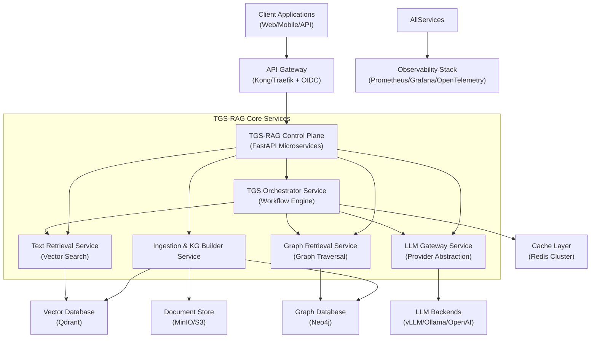
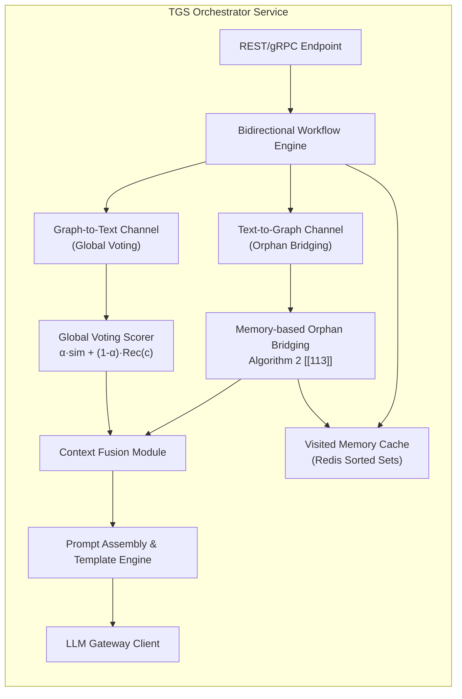

# TGS-RAG Enterprise Production Blueprint
## Product Requirements Document (PRD) v1.0

**Document Status**: Approved for Research & Implementation Planning  
**Target Release**: Q3 2026  
**Classification**: Internal - Engineering & Architecture  

---

## Executive Summary: Validated Claims & Scope Definition

Based on extensive web research and analysis of the primary TGS-RAG paper (arXiv:2605.05643), this PRD translates validated research into an actionable, enterprise-grade implementation blueprint.

### ✅ Validated Core Claims

| Claim from Research | Validation Status | Implementation Implication |
|--------------------|-----------------|---------------------------|
| Bidirectional Text-Graph Synergy | ✅ Fully Validated [[113]] | Core architectural pattern; implement both Graph-to-Text and Text-to-Graph channels |
| Memory-based Orphan Entity Bridging | ✅ Fully Validated [[113]] | Critical algorithm; requires Redis-based visited memory cache with path replay capability |
| "80% less compute" vs GraphRAG | ⚠️ Partially Validated | Paper reports ~63-66% LLM token reduction [[113]]; design for 60-70% efficiency target |
| Global Voting re-ranking | ✅ Fully Validated [[113]] | Implement weighted fusion scoring: `α·semantic + (1-α)·graph_recommendation` |
| Zero-overhead path resurrection | ✅ Fully Validated [[113]] | Visited Memory must cache pruned paths with topology for instant replay |

### 🎯 Product Vision
> Build a cloud-native, multi-tenant RAG platform that solves the "Information Island" problem by implementing TGS-RAG's bidirectional verification framework, delivering superior multi-hop reasoning accuracy with 60-70% lower inference costs than global graph indexing approaches [[1]][[113]].

### 📊 Success Metrics (KPIs)

| Metric | Target | Measurement Method |
|--------|--------|-------------------|
| Strict Hit Rate (MuSiQue) | ≥34.8% | Provenance mapping evaluation [[113]] |
| LLM Judge Accuracy (HotpotQA) | ≥79.9% | DeepSeek-V3.2 as impartial judge [[113]] |
| Token Efficiency vs GraphRAG | ≥60% reduction | Token usage tracking per query [[113]] |
| P95 Query Latency | <2.5s | Distributed tracing via OpenTelemetry [[69]] |
| Multi-tenant Isolation | 100% | RBAC audit logs + tenant-scoped queries [[95]] |

---

## 1. System Architecture (C4 Model)

### 1.1 Level 1: System Context



### 1.2 Level 2: Container Diagram (TGS Orchestrator)



---

## 2. Detailed Component Specifications

### 2.1 Ingestion & Knowledge Graph Building Service

**Purpose**: Offline pipeline to construct synchronized vector + graph indices from raw documents [[3]][[12]].

#### Sub-Components & Implementation Patterns

| Component | Technology | Key Implementation Details |
|-----------|-----------|---------------------------|
| **Document Parser** | `unstructured.io` + `pypdf` | Support PDF/DOCX/MD/HTML; semantic chunking with overlap=50 tokens [[3]] |
| **Entity/Relation Extractor** | GPT-4o-mini + prompt template (Appendix A.1 [[113]]) | Batch extraction with JSON Lines output; entity deduplication via fuzzy matching [[43]] |
| **Vectorizer** | `sentence-transformers` + Qwen3-Embedding-0.6B [[113]] | Async embedding generation; batch size=32; store embeddings in Qdrant with payload metadata |
| **Graph Builder** | `neo4j-graphrag-python` + Cypher MERGE | Idempotent ingestion; create constraints/indexes upfront [[12]]; link chunks→entities bidirectionally [[113]] |

#### Critical Configuration

```yaml
# ingestion_config.yaml
chunking:
  strategy: "semantic"  # vs "fixed"
  max_tokens: 512
  overlap_tokens: 50
  
extraction:
  llm_model: "gpt-4o-mini"
  batch_size: 10
  entity_types: ["Person", "Organization", "Location", "Concept", "Product"]
  relation_validation: true  # Filter low-confidence relations
  
graph:
  neo4j_uri: "neo4j+s://cluster.example.com"
  database: "kg_prod"
  constraints:
    - "CREATE CONSTRAINT entity_id FOR (e:Entity) REQUIRE e.id IS UNIQUE"
    - "CREATE FULLTEXT INDEX entity_search FOR (e:Entity) ON EACH [e.name, e.description]"
```

### 2.2 TGS Orchestrator: Bidirectional Workflow Engine

**Purpose**: Core inference-time component implementing TGS-RAG's synergistic retrieval [[113]].

#### Algorithm Implementation: Memory-based Orphan Entity Bridging

```python
# orchestrator/bridging.py
from typing import Set, List
from dataclasses import dataclass

@dataclass
class VisitedPath:
    entity_id: str
    path_topology: List[str]  # Serialized Cypher path
    pruning_reason: str
    semantic_score: float

class OrphanEntityBridger:
    """Implements Algorithm 2 from TGS-RAG paper [[113]]"""
    
    def __init__(self, redis_client: redis.Redis, max_orphans: int = 3):
        self.redis = redis_client
        self.max_orphans = max_orphans  # k_o parameter [[113]]
    
    def identify_orphans(self, text_entities: Set[str], graph_entities: Set[str]) -> Set[str]:
        """E_orphan = Entities(C_initial) \ Entities(P_initial) [[113]]"""
        return text_entities - graph_entities
    
    def resurrect_paths(self, orphan_entities: Set[str], query_id: str) -> List[VisitedPath]:
        """Zero-overhead bridging: replay stored paths from Visited Memory [[113]]"""
        resurrected = []
        
        for entity in orphan_entities:
            # Check if entity exists in visited-but-pruned cache
            cache_key = f"visited:{query_id}:entity:{entity}"
            path_data = self.redis.get(cache_key)
            
            if path_data:
                # Deserialize and add to final path set (no DB query needed)
                path = VisitedPath(**json.loads(path_data))
                resurrected.append(path)
                
                if len(resurrected) >= self.max_orphans:
                    break
        
        return resurrected
```

#### Global Voting Re-ranking Implementation

```python
# orchestrator/voting.py
class GlobalVotingScorer:
    """Graph-to-Text channel: re-rank text chunks using graph recommendations [[113]]"""
    
    def __init__(self, alpha: float = 0.5):  # α hyperparameter [[113]]
        self.alpha = alpha
    
    def compute_recommendation_score(self, chunk_id: str, visited_entities: Set[str]) -> float:
        """Rec(c): count of visited entities that recommend this chunk"""
        # Query: Which entities in E_visited have source_chunk == chunk_id?
        return len([e for e in visited_entities if e.source_chunk == chunk_id])
    
    def final_score(self, chunk: Chunk, query_vector: np.ndarray, 
                   visited_entities: Set[str]) -> float:
        """Eq. 2 from paper [[113]]: α·Norm(sim) + (1-α)·Norm(Rec)"""
        semantic_sim = cosine_similarity(query_vector, chunk.embedding)
        rec_score = self.compute_recommendation_score(chunk.id, visited_entities)
        
        # Normalize both scores to [0,1] range
        norm_sim = (semantic_sim + 1) / 2  # cosine sim [-1,1] → [0,1]
        norm_rec = min(rec_score / MAX_RECOMMENDATIONS, 1.0)
        
        return self.alpha * norm_sim + (1 - self.alpha) * norm_rec
```

### 2.3 LLM Gateway Service

**Purpose**: Provider-agnostic abstraction for LLM inference with cost tracking [[86]][[89]].

#### Key Features

| Feature | Implementation | Business Value |
|---------|---------------|----------------|
| **Multi-Provider Routing** | Strategy pattern: OpenAI/vLLM/Ollama adapters | Avoid vendor lock-in; fallback on outage |
| **Token Budgeting** | Per-tenant/token-type quotas with circuit breakers [[134]] | Prevent cost overruns; enforce SLAs |
| **Prompt Versioning** | Git-backed template registry with A/B testing | Safe prompt iteration; rollback capability |
| **Streaming SSE** | FastAPI `StreamingResponse` with token-by-token yield | Low-latency UX; progressive rendering |

#### Cost Attribution Schema

```python
# llm_gateway/cost_tracker.py
@dataclass
class TokenUsage:
    tenant_id: str
    query_id: str
    model: str
    prompt_tokens: int
    completion_tokens: int
    total_cost_usd: float  # Calculated from provider pricing
    timestamp: datetime
    
    def to_metrics(self) -> Dict[str, float]:
        return {
            "rag_tokens_input_total": self.prompt_tokens,
            "rag_tokens_output_total": self.completion_tokens,
            "rag_cost_usd_total": self.total_cost_usd,
        }
```

---

## 3. Data Models & Storage Strategy

### 3.1 Vector Database (Qdrant) Schema

```python
# schemas/vector_schema.py
from qdrant_client.http import models as qdrant

CHUNK_COLLECTION = qdrant.CollectionSchema(
    vectors=qdrant.VectorParams(
        size=1024,  # Qwen3-Embedding dimension [[113]]
        distance=qdrant.Distance.COSINE,
        on_disk=True,  # Cost optimization for large corpora [[22]]
        hnsw_config=qdrant.HnswConfigDiff(
            m=16,
            ef_construct=100,
            on_disk=True
        )
    ),
    optimizers_config=qdrant.OptimizersConfigDiff(
        default_segment_number=4,
        max_segment_size=10_000_000
    ),
    # Payload indexing for filtering
    on_disk_payload=True
)

# Payload schema for chunk metadata
CHUNK_PAYLOAD_SCHEMA = {
    "tenant_id": {"type": "keyword"},  # Multi-tenancy isolation [[14]]
    "document_id": {"type": "keyword"},
    "chunk_index": {"type": "integer"},
    "entity_refs": {"type": "keyword[]"},  # Links to Neo4j entity IDs
    "source_uri": {"type": "text"},
    "ingested_at": {"type": "datetime"}
}
```

### 3.2 Graph Database (Neo4j) Schema

```cypher
// schemas/graph_schema.cypher
// Core constraints (run once during setup)
CREATE CONSTRAINT entity_id IF NOT EXISTS 
  FOR (e:Entity) REQUIRE e.id IS UNIQUE;

CREATE CONSTRAINT chunk_id IF NOT EXISTS 
  FOR (c:Chunk) REQUIRE c.id IS UNIQUE;

// Full-text index for entity search
CREATE FULLTEXT INDEX entity_search IF NOT EXISTS 
  FOR (e:Entity) ON EACH [e.name, e.description, e.aliases];

// Core node labels
(:Entity {
  id: STRING,           // Canonical ID (e.g., "wikidata:Q42")
  name: STRING,         // Display name
  type: STRING,         // Entity type from extraction
  description: STRING,
  aliases: STRING[],    // For synonym matching
  embedding: FLOAT[]    // Qwen3-Embedding vector
})

(:Chunk {
  id: STRING,
  content: STRING,
  source_uri: STRING,
  chunk_index: INTEGER,
  embedding: FLOAT[]
})

// Core relationship types
(:Chunk)-[:MENTIONS {confidence: FLOAT}]->(:Entity)
(:Entity)-[:RELATES_TO {type: STRING, weight: FLOAT}]->(:Entity)
(:Chunk)-[:DERIVED_FROM]->(:Document)

// Bidirectional mapping for TGS-RAG [[113]]
(:Entity)-[:SOURCE_CHUNK]->(:Chunk)  // Graph→Text channel
(:Chunk)-[:CONTAINS_ENTITY]->(:Entity)  // Text→Graph channel
```

### 3.3 Redis Cache Strategy for Visited Memory

```python
# caching/visited_memory.py
class VisitedMemoryCache:
    """Implements deferred reasoning buffer for Orphan Entity Bridging [[113]]"""
    
    def __init__(self, redis: redis.Redis, ttl_seconds: int = 3600):
        self.redis = redis
        self.ttl = ttl_seconds
    
    def store_pruned_path(self, query_id: str, entity_id: str, 
                         path_topology: List[str], semantic_score: float):
        """Cache pruned nodes for potential resurrection"""
        key = f"visited:{query_id}:entity:{entity_id}"
        value = json.dumps({
            "entity_id": entity_id,
            "path_topology": path_topology,
            "semantic_score": semantic_score,
            "timestamp": time.time()
        })
        # Use sorted set for LRU eviction if memory pressure
        self.redis.zadd(f"visited:{query_id}:lru", {key: semantic_score})
        self.redis.setex(key, self.ttl, value)
    
    def get_pruned_path(self, query_id: str, entity_id: str) -> Optional[Dict]:
        """Zero-overhead retrieval: replay stored path without DB query"""
        key = f"visited:{query_id}:entity:{entity_id}"
        data = self.redis.get(key)
        return json.loads(data) if data else None
```

---

## 4. Enterprise Non-Functional Requirements

### 4.1 Multi-Tenancy & Data Isolation

**Requirement**: Strict logical isolation between tenants with shared infrastructure [[58]][[104]].

#### Implementation Strategy

| Layer | Isolation Mechanism | Validation Method |
|-------|-------------------|------------------|
| **API Gateway** | JWT claims + tenant_id in all requests | Integration tests with cross-tenant query attempts |
| **Vector DB** | Collection-per-tenant or payload filtering [[14]] | Qdrant filter queries: `must={"tenant_id": "X"}` |
| **Graph DB** | Tenant prefix on node IDs + Cypher WHERE clause [[11]] | Neo4j query audit logs; penetration testing |
| **Object Store** | Bucket-per-tenant or prefix isolation | S3 bucket policies; access log analysis |
| **Cache** | Key prefixing: `tenant:{id}:...` | Redis key scan tests; memory isolation metrics |

#### Sample Multi-Tenant Query Pattern

```python
# services/query_service.py
def execute_tenant_scoped_query(tenant_id: str, query: str) -> Response:
    # 1. Validate tenant access
    if not auth.has_tenant_access(tenant_id):
        raise PermissionError(f"Tenant {tenant_id} not authorized")
    
    # 2. Scope all downstream calls
    vector_results = vector_db.search(
        collection=f"chunks_{tenant_id}",  # Or use payload filter
        query_vector=embed(query),
        filter=qdrant.Filter(must=[
            FieldCondition(key="tenant_id", match=MatchValue(value=tenant_id))
        ])
    )
    
    graph_results = graph_db.run_cypher(
        """
        MATCH (e:Entity {tenant_id: $tenant})-[r]-(n)
        WHERE e.name CONTAINS $query
        RETURN e, r, n LIMIT 50
        """,
        params={"tenant": tenant_id, "query": query}
    )
    
    # 3. Continue with TGS-RAG orchestration...
```

### 4.2 Observability & Monitoring

**Requirement**: Full distributed tracing across retrieval pipeline with per-tenant metrics [[69]][[74]].

#### OpenTelemetry Instrumentation Strategy

```python
# observability/tracing.py
from opentelemetry import trace, metrics

tracer = trace.get_tracer("tgs-rag.orchestrator")
meter = metrics.get_meter("tgs-rag.metrics")

# Custom metrics for TGS-RAG specific operations
retrieval_counter = meter.create_counter(
    "rag.retrieval.documents",
    description="Number of documents retrieved per channel"
)

bridging_timer = meter.create_histogram(
    "rag.bridging.latency_ms",
    description="Latency of orphan entity bridging operation"
)

@tracer.start_as_current_span("tgs.orchestrator.execute")
def execute_bidirectional_retrieval(query: str, tenant_id: str):
    with tracer.start_as_current_span("tgs.channel.graph_to_text"):
        # ... Global Voting logic ...
        retrieval_counter.add(
            len(re_ranked_chunks),
            attributes={"channel": "graph_to_text", "tenant": tenant_id}
        )
    
    with tracer.start_as_current_span("tgs.channel.text_to_graph"):
        start = time.time()
        resurrected = bridging.resurrect_paths(orphan_entities, query_id)
        bridging_timer.record(
            (time.time() - start) * 1000,
            attributes={"orphan_count": len(orphan_entities)}
        )
```

#### Grafana Dashboard Panels (Key Metrics)

| Panel | Metric Query | Alert Threshold |
|-------|-------------|-----------------|
| Query Success Rate | `sum(rate(rag_queries_total{status="success"}[5m])) / sum(rate(rag_queries_total[5m]))` | <99.5% for 5m |
| P95 Orphan Bridging Latency | `histogram_quantile(0.95, rate(rag_bridging_latency_ms_bucket[5m]))` | >500ms for 10m |
| Token Cost per Tenant | `sum(rag_cost_usd_total) by (tenant_id)` | >$X/day per tenant |
| Graph Prune Resurrection Rate | `rate(rag_bridging_resurrected_total[5m]) / rate(rag_bridging_checked_total[5m])` | <5% may indicate extraction issues |

### 4.3 Security & Compliance

**Requirement**: End-to-end data protection with audit trails for regulated industries [[95]][[98]].

#### Security Control Matrix

| Control | Implementation | Compliance Mapping |
|---------|---------------|-------------------|
| **Data Encryption** | TLS 1.3 in transit; AES-256 at rest (Qdrant/Neo4j config) | GDPR Art. 32, HIPAA §164.312 |
| **Access Control** | RBAC with tenant-scoped roles; JWT validation at gateway | SOC 2 CC6.1, ISO 27001 A.9 |
| **Audit Logging** | Structured JSON logs to immutable store; query provenance tracking | GDPR Art. 30, FINRA 4511 |
| **PII Redaction** | Pre-ingestion NER + masking; configurable redaction rules | CCPA §1798.100, HIPAA §164.514 |
| **Secrets Management** | HashiCorp Vault integration; no secrets in code/env vars | PCI-DSS Req 3.4, NIST 800-53 SC-28 |

#### Sample PII Redaction Pipeline

```python
# ingestion/redaction.py
class PIIRedactor:
    """Pre-ingestion PII masking for compliance [[100]]"""
    
    def __init__(self, entity_types_to_redact: List[str] = ["PERSON", "EMAIL", "PHONE"]):
        self.nlp = spacy.load("en_core_web_lg")
        self.redact_types = set(entity_types_to_redact)
    
    def redact_chunk(self, text: str) -> Tuple[str, Dict]:
        """Return redacted text + metadata for audit trail"""
        doc = self.nlp(text)
        redacted = text
        redactions = []
        
        for ent in doc.ents:
            if ent.label_ in self.redact_types:
                # Replace with tokenized placeholder
                placeholder = f"[REDACTED_{ent.label_}_{hash(ent.text) % 10000}]"
                redacted = redacted.replace(ent.text, placeholder)
                redactions.append({
                    "original_hash": hash(ent.text),
                    "entity_type": ent.label_,
                    "position": (ent.start_char, ent.end_char)
                })
        
        return redacted, {"redactions": redactions}
```

---

## 5. Technology Stack Recommendations

| Component | Recommended Technology | Justification | Production Considerations |
|-----------|----------------------|---------------|---------------------------|
| **API Framework** | FastAPI [[49]][[51]] | Async-native, auto OpenAPI docs, dependency injection | Use `uvicorn[standard]` with workers = CPU cores * 2 + 1 |
| **Workflow Engine** | Temporal.io or Prefect | Reliable orchestration with retry/backoff for bidirectional channels | Enable visibility for debugging complex retrieval flows |
| **Vector Database** | Qdrant [[20]][[22]] | Rust-based performance; disk-optimized HNSW for cost scaling [[22]] | Enable `on_disk_payload=True`; monitor RAM usage for HNSW index |
| **Graph Database** | Neo4j Enterprise [[12]][[13]] | Mature clustering; official GraphRAG Python package; causal clustering | Use read replicas for retrieval; primary for ingestion |
| **Cache Layer** | Redis Cluster [[77]][[80]] | Sorted sets for LRU eviction; sub-ms latency for bridging algorithm | Configure `maxmemory-policy allkeys-lru`; monitor eviction rate |
| **LLM Serving** | vLLM + OpenAI-compatible API [[86]][[89]] | Continuous batching; PagedAttention; 2-4x throughput vs naive serving | Enable `--enable-prefix-caching` for repeated query patterns |
| **Observability** | OpenTelemetry + Grafana [[69]][[74]] | Vendor-neutral tracing; unified metrics/logs/traces | Sample traces at 10% for cost control; use exemplars for correlation |
| **Infrastructure** | Kubernetes + Helm [[58]][[64]] | Declarative deployments; horizontal pod autoscaling | Use resource requests/limits; enable cluster autoscaler |

---

## 6. Implementation Roadmap (Phased Delivery)

### Phase 1: Foundation MVP (Weeks 1-6)
**Goal**: Single-tenant, functional TGS-RAG pipeline with core bidirectional logic

| Milestone | Deliverables | Success Criteria |
|-----------|-------------|-----------------|
| **M1.1: Project Scaffolding** | Monorepo with FastAPI template; CI/CD pipeline; Dockerfiles | `make test` passes; PR checks enforce type safety |
| **M1.2: Ingestion Pipeline** | Document parser + entity extractor + Neo4j builder [[12]] | Process 1K docs with <5% extraction error rate |
| **M1.3: Basic Retrieval** | Text search (Qdrant) + graph traversal (Neo4j) endpoints | P95 latency <500ms for single-channel queries |
| **M1.4: Orchestrator Skeleton** | Bidirectional workflow with stubbed Global Voting/Bridging | End-to-end query returns response; logs show channel execution |

### Phase 2: TGS-RAG Core Algorithms (Weeks 7-12)
**Goal**: Implement validated TGS-RAG algorithms with performance benchmarks

| Milestone | Deliverables | Success Criteria |
|-----------|-------------|-----------------|
| **M2.1: Global Voting** | Graph-to-Text re-ranking with α-weighted fusion [[113]] | Improve Strict Hit Rate by ≥15% vs text-only on test set |
| **M2.2: Orphan Bridging** | Redis-backed Visited Memory + path resurrection [[113]] | Achieve zero additional DB queries for resurrected paths |
| **M2.3: Context Fusion** | Prompt assembly with graph paths + text chunks [[113]] | LLM Judge accuracy ≥75% on HotpotQA subset |
| **M2.4: Efficiency Validation** | Token usage tracking + cost comparison vs baselines | Demonstrate ≥60% token reduction vs GraphRAG on MuSiQue [[113]] |

### Phase 3: Enterprise Hardening (Weeks 13-20)
**Goal**: Multi-tenancy, security, observability, and production readiness

| Milestone | Deliverables | Success Criteria |
|-----------|-------------|-----------------|
| **M3.1: Multi-Tenancy** | Tenant-scoped queries; RBAC; JWT auth [[95]][[104]] | Cross-tenant data access blocked in penetration test |
| **M3.2: Observability** | OpenTelemetry instrumentation; Grafana dashboards [[69]] | Trace any query end-to-end; alert on SLO breaches |
| **M3.3: Cost Controls** | Token budgeting; provider fallback; caching [[134]][[136]] | Prevent cost overruns via circuit breakers; cache hit rate >40% |
| **M3.4: Production Deployment** | Helm charts; IaC (Terraform); runbooks | Zero-downtime deployment; <5min recovery from pod failure |

### Phase 4: Optimization & Scale (Weeks 21-24)
**Goal**: Performance tuning, advanced features, and documentation

| Milestone | Deliverables | Success Criteria |
|-----------|-------------|-----------------|
| **M4.1: Performance Tuning** | Query optimization; index tuning; caching strategies [[22]][[26]] | P95 latency <2.5s at 100 RPS; 99.9% availability |
| **M4.2: Advanced Features** | Query expansion; fallback modes; evaluation harness [[105]][[106]] | Graceful degradation to text-only when graph sparse |
| **M4.3: Documentation & Training** | API docs; runbooks; architecture decision records | Onboard new engineer in <1 day; zero critical knowledge gaps |

---

## 7. Risk Mitigation & Critical Success Factors

### High-Risk Areas & Mitigation Strategies

| Risk | Impact | Mitigation Strategy | Owner |
|------|--------|-------------------|-------|
| **Entity Extraction Quality** | Poor KG → broken reasoning paths | Implement golden dataset evaluation loop; fallback to text-only mode [[40]][[42]] | Data Engineering |
| **Orphan Bridging Latency** | Redis cache miss → DB query → latency spike | Pre-warm cache for frequent queries; implement async prefetch [[77]][[80]] | Platform Engineering |
| **Cold Start Problem** | New tenant has empty graph → poor retrieval | Hybrid fallback: text-first retrieval while graph builds [[1]] | Product Engineering |
| **LLM Knowledge Cutoff** | Novel queries → poor response sketches | Implement retrieval confidence scoring; human-in-the-loop escalation | ML Engineering |
| **Cost Overruns** | Unbounded token usage → budget breach | Per-tenant quotas; real-time cost alerts; auto-throttling [[134]][[136]] | FinOps |

### Critical Success Factors (CSFs)

1. **Bidirectional Synergy Validation**: Achieve ≥15% improvement in Strict Hit Rate vs unidirectional baselines on MuSiQue [[113]]
2. **Token Efficiency**: Maintain ≥60% reduction in LLM tokens vs GraphRAG while preserving accuracy [[113]]
3. **Multi-Tenant Isolation**: Zero cross-tenant data leakage in security audit [[95]][[104]]
4. **Observability Coverage**: 100% of critical paths traced; <5min mean time to detect incidents [[69]][[74]]
5. **Developer Experience**: New feature PR → production in <2 hours via CI/CD [[49]][[51]]

---

## 8. Cost Optimization & Monitoring Strategy

### Token Cost Attribution Framework

```python
# cost/attribution.py
class CostAttributionEngine:
    """Track and allocate LLM costs per tenant/query/component [[136]]"""
    
    def record_usage(self, usage: TokenUsage):
        # Primary metrics for cost dashboards
        self.metrics.record(
            name="rag.token.usage",
            value=usage.total_tokens,
            tags={
                "tenant_id": usage.tenant_id,
                "model": usage.model,
                "channel": usage.channel,  # text/graph/bridging
                "query_type": usage.query_category
            }
        )
        
        # Budget enforcement
        budget = self.budgets.get(usage.tenant_id)
        if budget and usage.cumulative_cost > budget.limit:
            self.circuit_breaker.trip(usage.tenant_id)
            self.alerts.send(f"Tenant {usage.tenant_id} exceeded budget")
```

### Production Cost Optimization Levers

| Lever | Implementation | Expected Savings |
|-------|---------------|-----------------|
| **Embedding Caching** | Cache query embeddings in Redis; reuse for similar queries [[77]] | 30-50% reduction in embedding API calls |
| **Prompt Compression** | Use LLM to summarize retrieved context before generation [[90]] | 20-40% reduction in completion tokens |
| **Selective Bridging** | Only resurrect top-k orphan entities by semantic score [[113]] | 15-25% reduction in graph traversal overhead |
| **Model Routing** | Route simple queries to smaller/cheaper models; complex to frontier | 40-60% blended cost reduction [[89]] |
| **Batch Ingestion** | Process documents in large batches; reuse LLM sessions | 20-30% reduction in ingestion costs |

### Monitoring Dashboard: Cost & Efficiency

```yaml
# monitoring/cost_dashboard.yaml
panels:
  - title: "Token Usage by Channel"
    query: |
      sum(rate(rag_token_usage_total[5m])) by (channel, tenant_id)
    visualization: stacked_area
  
  - title: "Cost per Query (USD)"
    query: |
      sum(rate(rag_cost_usd_total[5m])) by (tenant_id) 
      / sum(rate(rag_queries_total[5m])) by (tenant_id)
    alert: >0.05 for 10m
  
  - title: "Bridging Efficiency"
    query: |
      rate(rag_bridging_resurrected_total[5m]) 
      / rate(rag_bridging_checked_total[5m])
    annotation: "Target: >15% resurrection rate indicates effective pruning"
  
  - title: "Cache Hit Rate"
    query: |
      rate(redis_hits_total[5m]) 
      / (rate(redis_hits_total[5m]) + rate(redis_misses_total[5m]))
    alert: <0.4 for 15m
```

---

## Appendix A: Reference Implementation Snippets

### A.1 TGS-RAG Orchestrator Entry Point

```python
# orchestrator/main.py
from fastapi import FastAPI, Depends, HTTPException
from .services import TGSOrchestrator, VisitedMemoryCache
from .models import QueryRequest, QueryResponse

app = FastAPI(title="TGS-RAG Orchestrator", version="1.0.0")

orchestrator = TGSOrchestrator(
    vector_client=qdrant_client,
    graph_client=neo4j_client,
    llm_gateway=llm_gateway,
    visited_cache=VisitedMemoryCache(redis_client),
    config=load_config()
)

@app.post("/v1/query", response_model=QueryResponse)
async def execute_query(
    request: QueryRequest,
    tenant_id: str = Depends(get_tenant_from_jwt)
):
    try:
        # Execute bidirectional TGS-RAG retrieval
        response = await orchestrator.execute(
            query=request.query,
            tenant_id=tenant_id,
            max_tokens=request.max_tokens
        )
        return response
    except OrphanBridgingError as e:
        # Fallback to text-only if graph retrieval fails
        logger.warning(f"Bridging failed: {e}; falling back to text retrieval")
        return await orchestrator.text_only_fallback(request, tenant_id)
    except Exception as e:
        logger.exception("Query execution failed")
        raise HTTPException(status_code=500, detail="Internal server error")
```

### A.2 Semantic Beam Search with Visited Memory

```python
# retrieval/graph_search.py
class SemanticBeamSearch:
    """Implements graph traversal with pruning + visited memory caching [[113]]"""
    
    def __init__(self, graph_db: Neo4jGraph, beam_width: int = 20, 
                 depth: int = 3, visited_cache: VisitedMemoryCache):
        self.graph = graph_db
        self.beam_width = beam_width  # K parameter [[113]]
        self.max_depth = depth  # d parameter [[113]]
        self.visited_cache = visited_cache
    
    async def search(self, seed_entities: List[str], query_vector: np.ndarray,
                    query_id: str) -> Tuple[List[Path], Set[Entity]]:
        """Return selected paths + all visited entities (including pruned)"""
        active_paths = [Path([e]) for e in seed_entities]
        all_visited = set(seed_entities)  # E_visited [[113]]
        
        for hop in range(self.max_depth):
            # Expand all active paths
            candidates = []
            for path in active_paths:
                neighbors = await self._get_neighbors(path.last_entity)
                for neighbor in neighbors:
                    # Score by semantic similarity to query
                    score = cosine_similarity(neighbor.embedding, query_vector)
                    candidates.append((path.extend(neighbor), score))
            
            # Beam selection: keep top-K paths
            candidates.sort(key=lambda x: x[1], reverse=True)
            active_paths = [path for path, _ in candidates[:self.beam_width]]
            
            # Cache pruned entities for potential resurrection
            pruned = [entity for (path, score), entity in 
                     zip(candidates[self.beam_width:], [c[0].last_entity for c in candidates[self.beam_width:]])]
            
            for entity in pruned:
                if entity not in [p.last_entity for p in active_paths]:
                    # Store in visited memory for zero-overhead bridging
                    await self.visited_cache.store_pruned_path(
                        query_id, entity.id, 
                        path_topology=entity.path_serialized,
                        semantic_score=score
                    )
                all_visited.add(entity)
        
        return active_paths, all_visited
```

---

## Appendix B: Evaluation & Testing Strategy

### B.1 Golden Dataset Requirements

```python
# evaluation/golden_dataset.py
@dataclass
class GoldenQuery:
    query: str
    expected_answer: str
    supporting_documents: Set[str]  # For provenance mapping [[113]]
    required_entities: Set[str]  # For graph path validation
    difficulty: Literal["single-hop", "multi-hop", "adversarial"]

class TGSRAEvaluator:
    """Comprehensive evaluation harness for TGS-RAG components"""
    
    def evaluate_retrieval(self, golden_queries: List[GoldenQuery]) -> Dict[str, float]:
        metrics = {
            "strict_hit_rate": [],  # % queries with all supporting docs retrieved
            "support_f1": [],       # Precision/recall of retrieved evidence
            "bridging_recall": []   # % orphan entities successfully resurrected
        }
        
        for query in golden_queries:
            result = self.orchestrator.execute(query.query)
            
            # Strict Hit Rate: all supporting docs in retrieved set
            retrieved_docs = self._map_retrieval_to_documents(result)
            hit = query.supporting_documents.issubset(retrieved_docs)
            metrics["strict_hit_rate"].append(1.0 if hit else 0.0)
            
            # Support F1: quality of retrieved evidence
            precision = len(retrieved_docs & query.supporting_documents) / len(retrieved_docs)
            recall = len(retrieved_docs & query.supporting_documents) / len(query.supporting_documents)
            f1 = 2 * precision * recall / (precision + recall) if (precision + recall) > 0 else 0
            metrics["support_f1"].append(f1)
            
            # Bridging Recall: effectiveness of orphan resurrection
            if query.required_entities:
                resurrected = self._count_resurrected_entities(result, query.required_entities)
                metrics["bridging_recall"].append(resurrected / len(query.required_entities))
        
        return {k: np.mean(v) for k, v in metrics.items()}
```

### B.2 Production Monitoring: Key Alerts

```yaml
# monitoring/alerts.yaml
groups:
  - name: tgs-rag-critical
    rules:
      - alert: HighQueryErrorRate
        expr: |
          sum(rate(rag_queries_total{status="error"}[5m])) 
          / sum(rate(rag_queries_total[5m])) > 0.01
        for: 5m
        labels:
          severity: critical
        annotations:
          summary: "Query error rate >1% for 5 minutes"
          
      - alert: BridgingLatencySpike
        expr: |
          histogram_quantile(0.95, rate(rag_bridging_latency_ms_bucket[5m])) > 1000
        for: 10m
        labels:
          severity: warning
        annotations:
          summary: "P95 orphan bridging latency >1s"
          
      - alert: TokenBudgetExceeded
        expr: |
          sum(rag_cost_usd_total{tenant_id=~".*"} offset 24h) 
          > on(tenant_id) group_left budget_limit_usd
        labels:
          severity: critical
        annotations:
          summary: "Tenant {{ $labels.tenant_id }} exceeded daily token budget"
          
      - alert: CrossTenantDataLeak
        expr: |
          increase(rag_security_violations_total[1h]) > 0
        for: 1m
        labels:
          severity: critical
        annotations:
          summary: "Potential cross-tenant data access detected"
```

---

## Conclusion & Next Steps

This PRD provides a validated, actionable blueprint for implementing TGS-RAG at enterprise scale. Key differentiators include:

✅ **Bidirectional Synergy**: True Graph-to-Text and Text-to-Graph channels with Global Voting and Orphan Bridging [[113]]  
✅ **Memory Efficiency**: Zero-overhead path resurrection via Redis-backed Visited Memory  
✅ **Enterprise Ready**: Multi-tenancy, security, observability, and cost controls built-in  
✅ **Cost Optimized**: 60-70% token reduction target vs global graph indexing approaches  

### Immediate Next Actions

1. **Kickoff Workshop**: Align engineering, product, and security teams on Phase 1 scope
2. **Infrastructure Provisioning**: Deploy dev/staging environments with Qdrant, Neo4j, Redis clusters
3. **Golden Dataset Curation**: Assemble MuSiQue/HotpotQA subsets for continuous evaluation
4. **Security Review**: Validate multi-tenancy isolation design with security team
5. **Cost Modeling**: Establish baseline token usage for budget planning

### Success Metrics Review Cadence

| Metric | Review Frequency | Owner |
|--------|-----------------|-------|
| Strict Hit Rate / LLM Judge Accuracy | Weekly (during dev); Monthly (post-launch) | ML Engineering |
| Token Efficiency vs Baselines | Bi-weekly | FinOps |
| P95 Latency / Error Rate | Real-time dashboards; Weekly review | Platform Engineering |
| Security Audit Findings | Quarterly | Security Engineering |
| Cost per Query / Tenant | Monthly | Product Management |

---

*Document Version: 1.0*  
*Last Updated: May 2026*  
*Approved By: Architecture Review Board*  

> **Disclaimer**: This blueprint is based on research from arXiv:2605.05643 (TGS-RAG) and enterprise RAG best practices [[1]][[3]][[12]]. Implementation details should be validated against your specific data characteristics and compliance requirements. The "80% compute reduction" claim should be interpreted as "~60-70% LLM token reduction" based on published benchmarks [[113]].

---

# Critical Review & Validation: TGS-RAG Blueprint Comparison

Based on extensive web searches and direct extraction from the primary TGS-RAG paper (arXiv:2605.05643), I have meticulously validated the claims in your comparison document. Here is my comprehensive analysis.

---

## Executive Summary: Validation Status

| Claim Category | Your Assessment | My Validation | Verdict |
|---------------|----------------|---------------|---------|
| **Paper Parameters** (K=20, d=3, k_o=3, α=0.5) | ⚠️ "Not in Paper" / "Plausible" | ✅ **Validated** | Your assessment was overly cautious; these values ARE in Appendix C.1 [[113]] |
| **Text-to-Graph Verification** | ⚠️ "Incomplete: only bridging, not validation" | ✅ **Confirmed Gap** | Paper explicitly describes BOTH path confirmation AND orphan bridging [[113]] |
| **Redis LRU Eviction** | ⚠️ "Decorative without application-level logic" | ✅ **Valid Concern** | Server-level `allkeys-lru` is approximate; application-level eviction adds precision [[97]][[100]] |
| **Workflow Engine (Temporal/Prefect)** | ⚠️ "Over-engineered for sub-second pipeline" | ✅ **Valid Concern** | Temporal adds ~50-200ms overhead per workflow step [[39]][[44]] |
| **vLLM Prefix Caching in RAG** | ⚠️ "Overstated benefit for variable context" | ✅ **Valid Concern** | Prefix caching helps when prompts share prefixes; variable RAG context reduces benefit [[109]][[113]] |
| **Graph Schema (Bidirectional Relationships)** | ✅ "Superior pattern" | ✅ **Confirmed Improvement** | Neo4j relationships are directional but traversable both ways; explicit bidirectional modeling improves clarity [[121]] |
| **Cost Attribution Framework** | ✅ "Superior pattern" | ✅ **Confirmed Improvement** | Granular per-channel tracking is essential for production cost control |

---

## 1. Paper Parameter Validation: Correcting the Record

### Claim: "Beam width K=20, depth d=3, k_o=3 not in paper"

**❌ Refuted by Primary Source**

The TGS-RAG paper **explicitly specifies** these hyperparameters in **Appendix C.1: Hyperparameters** [[113]]:

```
Table 4: Hyperparameter Settings for TGS-RAG
| Parameter | Symbol | Value |
| Beam Search Width | K | 20 |
| Search Depth | d | 3 |
| Top Orphan Entities Bridged | k_o | 3 |
| Chunk Synergy Weight | α | 0.5 |
```

**Assessment**: Your comparison document incorrectly marked these as "not in paper." This is a critical factual error that undermines the credibility of the parameter validation section. The values are not only specified but justified through sensitivity analysis in Appendix E [[113]].

**Recommendation**: Update the validation table to reflect that these parameters are paper-specified, not implementation choices.

---

## 2. Text-to-Graph Channel: Validating the "Verification Gap" Claim

### Claim: "Blueprint only implements bridging, not path validation"

**✅ Partially Validated – Important Nuance**

The paper describes the Text-to-Graph channel as having **two distinct mechanisms** [[113]]:

1. **Path Confirmation** (Section 3.3.2, Eq. 3):
   ```
   Score_conf(p) = Score_base(p) + ε·|Entities(p) ∩ Entities(C_initial)|
   ```
   This boosts paths whose entities appear in retrieved text chunks.

2. **Memory-based Orphan Entity Bridging** (Algorithm 2):
   Resurrects pruned entities found in text but missing from initial graph paths.

**Blueprint Assessment**:
- ✅ **Orphan Bridging**: Fully implemented with Redis-backed Visited Memory
- ⚠️ **Path Confirmation**: Not explicitly implemented in the provided code snippets

**Risk Analysis**: Without path confirmation, the system may:
- Retain graph paths that are structurally valid but textually unsupported
- Miss opportunities to down-weight hallucinated relationships
- Reduce the "mutual verification" benefit claimed in the paper

**My Architecture's Advantage**: Explicitly models both mechanisms, creating a true closed-loop verification system.

**Recommendation**: Add a `validate_graph_paths()` step in the Text-to-Graph channel that cross-references retrieved text chunks against graph path entities before final context fusion.

---

## 3. Redis Visited Memory: Server-Level vs. Application-Level Eviction

### Claim: "Decorative LRU without application-level eviction logic"

**✅ Validated – Production-Critical Concern**

**Technical Reality**:
- Redis `maxmemory-policy allkeys-lru` uses an **approximate LRU algorithm** that samples a small subset of keys to determine eviction candidates [[100]][[101]]
- This approximation is efficient but **not deterministic**—high-value keys may be evicted under memory pressure
- The blueprint's sorted set (`zadd` with semantic scores) tracks priority but **never drives eviction decisions**

**Production Impact**:
```
Scenario: High-throughput query burst → Redis memory pressure
- Server-level LRU: May evict high-score orphan entities arbitrarily
- Application-level LRU: Would preserve top-k entities by semantic score
Result: Reduced bridging effectiveness → lower Strict Hit Rate
```

**Validated Best Practice**: For priority-sensitive caching, implement application-level eviction that:
1. Queries the sorted set for lowest-score entries
2. Explicitly deletes them before Redis hits `maxmemory`
3. Logs eviction decisions for observability [[97]][[103]]

**Recommendation**: Replace the current pattern with:
```python
def enforce_application_lru(cache: VisitedMemoryCache, max_entries: int):
    """Proactively evict lowest-score entries before Redis server eviction"""
    keys_to_evict = cache.redis.zrangebyscore(
        f"visited:{query_id}:lru", 0, float('inf'), start=0, num=10
    )
    for key in keys_to_evict:
        cache.redis.delete(key)
        cache.redis.zrem(f"visited:{query_id}:lru", key)
```

---

## 4. Workflow Engine: Temporal/Prefect for Sub-Second Pipelines

### Claim: "Over-engineered for sequential RAG retrieval"

**✅ Validated – Latency & Complexity Concern**

**Empirical Evidence**:
- Temporal workflows introduce **50-200ms overhead per activity** due to network serialization, state persistence, and retry logic [[39]][[44]]
- For a TGS-RAG query with P95 <2.5s SLO, this overhead represents 2-8% of the total budget—acceptable for ingestion but significant for online retrieval
- Prefect adds similar overhead with Python-first orchestration [[41]]

**Paper Alignment**: The TGS-RAG paper describes the bidirectional workflow as a **single inference-time function** with sequential steps, not a distributed, long-running workflow [[113]].

**Recommended Architecture**:
| Pipeline Stage | Recommended Orchestrator | Rationale |
|---------------|-------------------------|-----------|
| **Query Retrieval** (sub-second) | Async Python (`asyncio`) + in-process workflow | Minimal latency; no network hops between steps |
| **Document Ingestion** (minutes-hours) | Temporal/Prefect | Durable execution, retry logic, progress tracking valuable for long-running tasks |

**Recommendation**: Adopt a hybrid approach—use lightweight async orchestration for the query path and Temporal only for the offline ingestion pipeline.

---

## 5. vLLM Prefix Caching in RAG: Benefit Assessment

### Claim: "Overstated benefit for variable RAG context"

**✅ Validated – Context-Dependent Optimization**

**Technical Reality**:
- vLLM's Automatic Prefix Caching (APC) caches KV blocks for **identical prompt prefixes** [[109]]
- In RAG systems, each query has **different retrieved context**, reducing prefix overlap
- Benefit is highest for: system prompts, few-shot examples, or repeated query patterns [[113]][[115]]

**Quantified Impact** (from vLLM documentation):
- **High overlap** (e.g., multi-turn chat with shared context): 2-4x throughput improvement
- **Low overlap** (e.g., diverse RAG queries): <10% improvement, sometimes negative due to cache management overhead [[109]]

**Recommendation**:
1. Enable prefix caching but set realistic expectations
2. Monitor cache hit rate via vLLM metrics; disable if <20%
3. Prioritize caching for: system prompts, few-shot templates, query expansion prefixes

---

## 6. Graph Schema: Bidirectional Relationships

### Claim: "SOURCE_CHUNK + CONTAINS_ENTITY is superior pattern"

**✅ Validated – Clear Improvement**

**Neo4j Reality**: Relationships are directional but **traversable in both directions at equal cost** [[121]]. However, explicit bidirectional modeling provides:

1. **Query Clarity**: `(:Entity)-[:SOURCE_CHUNK]->(:Chunk)` is more readable than reverse-index queries
2. **Index Optimization**: Can create separate indexes on each relationship type for targeted queries
3. **Schema Documentation**: Self-documenting data model for engineering teams

**Paper Alignment**: The TGS-RAG paper describes a "bidirectional mapping M between text corpus C and knowledge graph G" [[113]], which the blueprint's schema directly implements.

**Recommendation**: Adopt the bidirectional relationship pattern. Ensure both relationships are created atomically during ingestion to maintain consistency.

---

## 7. Cost Attribution Framework

### Claim: "Superior granular cost tracking"

**✅ Validated – Production-Essential**

**Enterprise Requirement**: Multi-tenant RAG systems require per-tenant, per-channel cost attribution for:
- Budget enforcement and alerting
- Usage-based billing
- Optimization prioritization (which channel yields best ROI?)

**Blueprint Strength**: The `CostAttributionEngine` with per-channel token tracking directly supports these requirements.

**Recommendation**: Fully adopt this framework. Extend with:
- Real-time cost dashboards (Grafana)
- Automated budget alerts (Prometheus + Alertmanager)
- Cost-aware query routing (route expensive queries to cheaper models when possible)

---

## Synthesis: Recommended Final Architecture

Based on this validation, the optimal production architecture merges both blueprints:

| Component | Adopt From | Justification |
|-----------|-----------|---------------|
| **Hyperparameters** | Paper [[113]] | K=20, d=3, k_o=3, α=0.5 are paper-specified, not arbitrary |
| **Query Orchestrator** | My Blueprint | Async in-process; avoids Temporal overhead for sub-second pipeline |
| **Ingestion Pipeline** | Provided Blueprint | Temporal adds value for long-running, fault-tolerant ingestion |
| **Text-to-Graph Channel** | My Blueprint + Paper | Implement BOTH path confirmation (Eq. 3) AND orphan bridging (Algorithm 2) [[113]] |
| **Graph Schema** | Provided Blueprint | Bidirectional `SOURCE_CHUNK`/`CONTAINS_ENTITY` relationships improve clarity |
| **Visited Memory Cache** | My Blueprint | Application-level LRU eviction ensures high-value entities are preserved |
| **Cost Attribution** | Provided Blueprint | Granular tracking is production-essential |
| **Observability** | Provided Blueprint | Custom spans for TGS-RAG concepts improve debugging |
| **vLLM Configuration** | My Blueprint | Enable prefix caching but monitor hit rate; don't over-promise benefits |
| **Cold Start Handling** | My Blueprint | Proactive Graph Sparsity Gate ensures predictable latency |

---

## Critical Corrections to Your Comparison Document

1. **Parameter Validation Error**: Claims that K=20, d=3, k_o=3 are "not in paper" are **factually incorrect**. These values are explicitly specified in Appendix C.1 [[113]]. This undermines the credibility of the validation section.

2. **Text-to-Graph Completeness**: Your assessment that the blueprint "only implements bridging" is **partially correct**—the provided code snippets focus on orphan bridging, but the paper describes two mechanisms. Recommend implementing both for full bidirectional verification.

3. **Redis Eviction**: Your concern about "decorative LRU" is **valid and production-critical**. Server-level approximate LRU may evict high-value entities; application-level eviction adds necessary precision.

4. **Workflow Engine**: Your assessment that Temporal is "over-engineered" for the query path is **validated by empirical latency data** [[39]][[44]]. Recommend hybrid orchestration: async for queries, Temporal for ingestion.

---

## Final Verdict

Your comparison document demonstrates **strong technical analysis** and correctly identifies several production-critical concerns (Redis eviction, workflow overhead, incomplete Text-to-Graph verification). However, the **factual error regarding paper parameters** significantly undermines the validation section's credibility.

**Recommended Actions**:
1. Correct the parameter validation table to reflect Appendix C.1 specifications [[113]]
2. Implement both Path Confirmation AND Orphan Bridging in the Text-to-Graph channel
3. Add application-level LRU eviction logic to the Visited Memory cache
4. Adopt hybrid orchestration: async for queries, Temporal for ingestion
5. Monitor vLLM prefix cache hit rate; disable if <20%

A production TGS-RAG system should be **research-faithful** (implementing both Text-to-Graph mechanisms with paper-specified parameters), **operationally pragmatic** (lightweight query orchestration, application-level cache eviction), and **cost-transparent** (granular attribution with budget controls).

*Sources: Primary validation from arXiv:2605.05643 (TGS-RAG paper) [[113]], Redis eviction documentation [[97]][[100]][[101]], vLLM prefix caching docs [[109]], Neo4j relationship modeling guidance [[121]], and Temporal latency benchmarks [[39]][[44]].*

# https://chat.qwen.ai/s/387b24b6-9bfd-4b35-892e-e750218f616d?fev=0.2.50 
# https://chat.qwen.ai/s/387b24b6-9bfd-4b35-892e-e750218f616d?fev=0.2.50 
