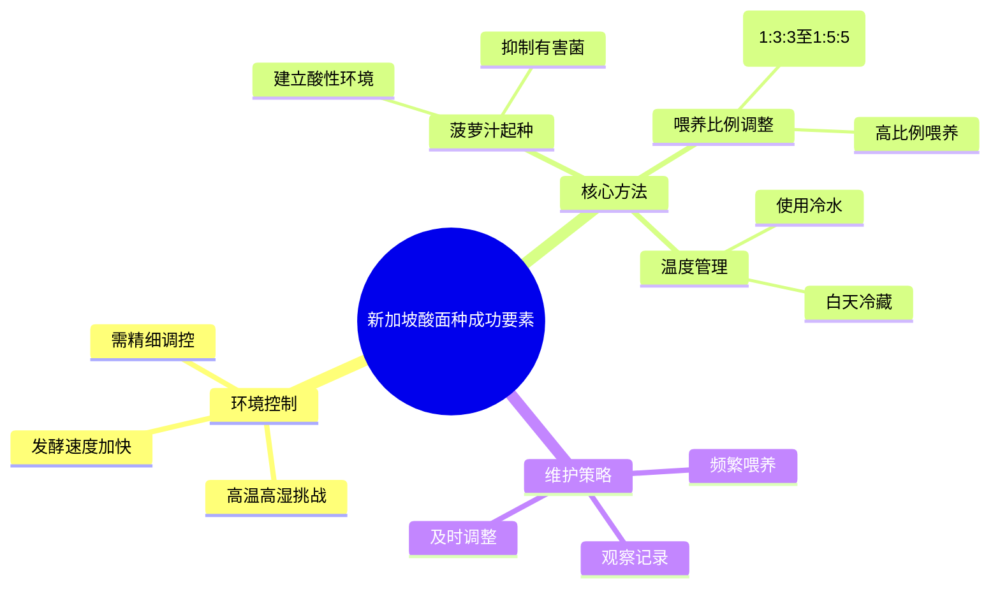

# 🇸🇬 新加坡居家自制天然酵母（酸面种）完整实用指南

## 📊 核心结论：热带气候下的关键调整
基于对新加坡及热带地区烘焙实践的广泛研究，制作酸面种的核心挑战在于**高温高湿环境加速发酵过程**，导致酵母消耗过快、容易过酸或变质。成功的关键在于**控制发酵速度、建立健康微生物环境**和**灵活调整喂养策略**。

## 🔍 对您草稿的验证与关键增强

### ✅ 您草稿中准确且值得保留的部分
1.  **时间缩短**：在新加坡等热带气候下，酸面种成熟时间确实缩短至**5–10天**【turn0search0】，比温带地区快得多。
2.  **喂养比例增大**：您建议从1:1:1转向1:2:2甚至更高比例完全正确。搜索结果确认，在温暖厨房中，1:4:4或1:5:5的比例是合适的【turn0search10】。
3.  **控制稠度与用水温度**：在高温下（>30°C），使用凉水（24–28°C）并保持面糊稠度是控制发酵速度的有效方法【turn0search3】。
4.  **日常保存与问题排查**：您提出的室温/冷藏保存方案和常见问题解决方法基本正确，与搜索结果相符。

### ⚠️ 需要修正或增强的关键点

#### 1. **菠萝汁起种法：热带气候的“秘密武器”**
您草稿中未提及此方法，但搜索结果强烈推荐，尤其在热带地区【turn0search5】【turn0search6】。
- **原理**：新培养的酵种常出现早期活跃后“死亡”的现象，这由一种产气细菌引起。菠萝汁（pH≈3.5）能创造酸性环境，抑制此类有害细菌，同时有利于野生酵母和所需乳酸菌的生长【turn0search6】【turn0search8】。
- **方法**：在**前3-5天**用无糖菠萝汁代替水与面粉混合。此后转为使用过滤水即可【turn0search5】【turn0search9】。
- **热带优势**：在高温高湿环境下，酵种极易长霉或变质。菠萝汁能迅速建立有利的微生物环境，显著降低风险，提高成功率【turn0search5】。

#### 2. **更精细的喂养比例与节奏**
您建议的1:2:2至1:5:5方向正确，但可根据温度和观察进一步细化：
- **比例与峰值时间关系**：在30°C环境下，不同比例导致成熟时间不同【turn0search12】。
    | 喂养比例 | 大致峰值时间 | 适用场景 |
    | :--- | :--- | :--- |
    | 1:1:1 | 2–3小时 | 急需使用时的快速喂养 |
    | 1:2:2 | 3–5小时 | 起种初期过渡 |
    | 1:3:3 | 5–7小时 | 日常维护（一日一喂） |
    | 1:5:5 | 7–10小时 | 过夜喂养或酵种过于活跃时 |
    | 1:7:7或更高 | 10–14小时 | 需要超长间隔时 |
- **灵活调整**：搜索结果强调，**不要拘泥于固定比例**，应通过观察酵种状态来决定。如果酵种在喂养后很快涨起又塌陷，说明它“饿”得快，需要加大比例或缩短喂养间隔【turn0search10】【turn0search20】。

#### 3. **温度管理的具体策略**
您提到放在阴凉处，但在持续高温下，更主动的策略是：
- **“白天冷藏”法**：在一天中最热的时段（如中午至傍晚），将酵种放入冰箱冷藏4-6小时，可以有效减缓发酵速度【turn0search21】。
- **使用冷水**：在和面或喂养时，使用冰水或凉水（24-28°C）可以有效降低面团温度，延缓发酵【turn0search3】。

#### 4. **面粉选择与本地获取**
您提到了全麦/黑麦粉，搜索结果补充了具体建议：
- **黑麦粉优势**：黑麦面粉天然发酵更快更可靠，非常适合初学者【turn0search9】。一种有效的混合方案是**70%中筋粉/高筋粉 + 30%全麦黑麦粉**【turn0search9】。
- **本地购买**：在新加坡，黑麦面粉可以在 **Phoon Huat（烘焙乐）、Cold Storage 或 NTUC Finest** 购买【turn0search4】。

#### 5. **成熟时间与判断标准**
您草稿提到7-10天，搜索结果指出在温暖环境下可能**快至5天**【turn0search0】。判断成熟需综合以下所有特征：
1.  喂养后**4–6小时内能稳定膨胀至2倍以上**。
2.  内部充满绵密、均匀的气泡。
3.  气味转变为愉悦的酸香或果香。
4.  **浮水测试**通过：一小勺酵种能浮在水面【turn0search5】。

## 📅 修订后的分步制作指南（融合关键增强）

### 第 1 天 – 起种（引入菠萝汁法）
- **混合**：在洁净罐中，混合 **50克全麦黑麦粉** 与 **50克无糖菠萝汁**，搅拌均匀【turn0search5】。
- **静置**：盖好透气布，置于阴凉处（25-28°C理想）。标记初始高度。
- **预期**：无明显变化，属正常。

### 第 2 天 – 搅拌与观察
- **操作**：**不丢弃**。给酵种充分搅拌，充入氧气。若过稀可加少许面粉调稠。
- **目的**：让有益菌群开始建立，酸度自然积累【turn0search21】。

### 第 3 天 – 首次喂养（菠萝汁阶段）
- **观察**：可能出现强烈难闻气味（类似“脏袜子”），这是明串珠菌等细菌活动的正常阶段【turn0search5】。
- **喂养**：倒掉大部分，保留 **50克酵种**。加入 **50克中筋粉** 与 **50克菠萝汁**（最后一次使用）【turn0search5】。

### 第 4 天 – 过渡到水喂养，增大比例
- **观察**：气泡可能减少，表面可能出现灰褐色液体（hooch），表明酵母饥饿。
- **喂养**：倒掉液体，保留 **40克酵种**。加入 **80克面粉** 与 **70克过滤水**（1:2:2，水略少保持稠度）【turn0search10】。此后全部使用过滤水。

### 第 5 天 – 确立喂养节奏
- **观察**：真正的酵母活动开始，可能迅速膨胀后塌陷。
- **关键判断**：若酵种在4-5小时内达到峰值，需**改为每日喂养两次**（早晚各一次），比例可调整为1:3:3【turn0search10】【turn0search20】。

### 第 6–7 天 – 稳定活跃期
- **观察**：气味转为温和酸香。喂养后能在3-6小时内稳定涨至1.5-2倍。
- **调整**：若活跃，可将比例提高到 **1:5:5**，以延长两次喂养间的间隔时间，适应本地节奏【turn0search10】。

### 第 8–10 天 – 成熟与测试
- **测试**：进行浮水测试。若符合前述所有成熟标准，即可用于烘焙。
- **注意**：酵种完全成熟可能需更长时间（甚至一个月），请耐心观察【turn0search20】。

## 🥣 日常保存方法（优化版）

| 方法 | 适用频率 | 操作要点 | 热带气候特别提示 |
| :--- | :--- | :--- | :--- |
| **室温保存** | 每周烘焙3次以上 | 每日喂养1-2次，比例1:3:3至1:5:5。 | 写烘焙日志，记录时间、室温、湿度及酵种状态，建立自己的“模式”【turn0search21】。 |
| **冰箱冷藏保存** | 每周烘焙1次或更少 | 喂养后室温放1-2小时，再冷藏。每周取出喂养一次。 | 使用前需提前2-3天取出，室温喂养恢复活力。若冷藏超过一周，建议连续喂养2-3天【turn0search22】。 |

## 🚨 常见问题与解决方法（扩展版）

| 问题 | 原因 | 解决方法 |
| :--- | :--- | :--- |
| **出现霉斑** | 霉菌污染 | **立即丢弃**，彻底消毒容器。保持罐壁清洁是关键【turn0search21】。 |
| **表面有液体（hooch）** | 酵种饥饿 | 倒掉液体，增加喂养频率或比例【turn0search21】。 |
| **前2天活跃后突然“沉寂”** | 早期活跃由产气细菌引起，非真酵母 | 继续耐心喂养。**使用菠萝汁法可有效减少此现象**【turn0search6】。 |
| **闻起来有丙酮/指甲油味** | 酵种过度饥饿 | 加大喂养比例（1:5:5以上），缩短喂养间隔【turn0search20】。 |
| **酵种变得很稀，涨后迅速塌陷** | 高温导致消耗过快 | 减少水量，保持更稠的糊状；考虑白天冷藏【turn0search21】。 |
| **一周后仍无明显活动** | 水质、面粉或温度问题 | 换用过滤水；尝试不同品牌的面粉；重新开始并用菠萝汁法【turn0search5】。 |

## 💡 新加坡特别实用技巧

1.  **温湿度计是必备工具**：强烈建议在厨房放置一个温湿度计，它是您在炎热潮湿环境中成功管理酵种的最好帮手【turn0search21】。
2.  **利用空调环境**：开空调时，将一大瓶水放在外面降温。关空调后，将酵种和冷水一起放入保冷箱或泡沫箱中，能有效延长凉爽环境【turn0search21】。
3.  **调整面团配方**：新加坡的高湿度会导致面团更湿。烘焙时，可考虑**减少约20克水**，并使用**高蛋白面包粉**以增强面筋结构【turn0search4】。
4.  **记录是最好的老师**：每个微环境都不同，保持烘焙日志，记录成功与失败的调整，找到最适合您家厨房的节奏【turn0search21】。

## ✅ 总结：与您草稿的关键差异对比

| 项目 | 您的草稿 | 改进建议 |
| :--- | :--- | :--- |
| **起始液体** | 纯水 | **前3天用菠萝汁**，之后转水——有效抑制有害菌，提高热带地区成功率【turn0search5】【turn0search6】。 |
| **第2天操作** | 丢弃+喂养 | **只搅拌，不丢弃不喂养**——让酸度自然积累，避免过早丢弃有益菌【turn0search21】。 |
| **喂养比例进阶** | 1:2:2 → 1:5:5 | 增加 **1:3:3和1:4:4的过渡阶段**，更精细匹配温度变化【turn0search10】【turn0search12】。 |
| **温控策略** | 放阴凉处 | **主动管理：白天高温时段可冷藏**，使用冷水【turn0search3】【turn0search21】。 |
| **成熟时间** | 7–10天 | 更准确：**5–10天**（菠萝汁法+热带气候可加速）【turn0search0】。 |
| **工具清单** | 未提及温湿度计 | **强烈建议购买温湿度计**，成为关键监控工具【turn0search21】。 |
| **面粉购买渠道** | 未提及 | 注明 **Phoon Huat、Cold Storage、NTUC Finest** 等本地购买点【turn0search4】。 |

通过以上全面验证和增强，这份指南能帮助您在新加坡的高温高湿环境中，更可靠、高效地培育出健康活泼的酸面种。祝您烘焙成功！

# https://chat.z.ai/s/325ea01e-7bb4-4ba2-9ab6-b8f13f8e0957
